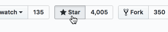

<a href='http://botpress.io'></a>
# [Botpress](https://botpress.io) — The open-source bot platform

[](https://circleci.com/gh/botpress/botpress)
[](https://www.npmjs.com/package/botpress)

Botpress is an open-source bot creation tool written in Javascript. It is powered by a rich set of open-source modules built by the community. We like to say that **Botpress is like the Wordpress of Chatbots**; anyone can create and reuse other people's modules.

---

### 📍 Botpress X (v10) is in beta

---

##### Learn Botpress

| 📖 [v10 **Documentation**](https://botpress.io/docs/10.0) | [📦Official Modules](https://github.com/botpress/modules) |
| ------------- | ------------- |

##### Follow us

| 🖥 [Website](https://botpress.io) | 💬 [Slack](https://slack.botpress.io) | 🚀 [Blog](https://botpress.io/blog) | 🐥 [Twitter](https://twitter.com/getbotpress)
| ------------- | ------- | -------- | --------- |

---

👉 Make sure you join our [Slack Community](https://slack.botpress.io) for help, announcements, gigs and fun!

## Support the project ⭐

If you feel awesome and want to support us in a small way, please consider starring and/or sharing the repo! This helps us getting known and grow the community. 🙏



## What is Botpress

Botpress is on a mission to make useful bots ubiquitous by powering developers with the best possible tools to build & manage chatbots. We believe that in order to create great bots, major time should be spent on UX, **not** on the surrounding (and generic) features.


## Getting Started Quickly

The best way to get started quickly is to read our [Getting Started Tutorial](https://botpress.io/docs/10.0/getting_started/).

## Installation

Botpress requires [node](https://nodejs.org) (version >= 6.10) and uses [npm](https://www.npmjs.com) as package manager.

```
npm install -g botpress@beta
```

## Creating a bot

Creating a bot is simple, you need to run [`botpress init`](https://botpress.io/docs/reference/cli.html#init) in a terminal inside an empty directory:

```
botpress init my-bot
```

Once your bot is created, you need to run [`botpress start`](https://botpress.io/docs/reference/cli.html#start) to start your bot:

```
botpress start
```

This will provide you locally a web interface available at **`http://localhost:3000`**

## [📦Official Modules](https://github.com/botpress/modules)

## Contributing

Thanks you for your interest in Botpress. Here are some of the many ways to contribute.

  - Check out our [contributing guide](/.github/CONTRIBUTING.md)
  - Look at our [code of conduct](/.github/CODE_OF_CONDUCT.md)
  - Engage with us on Social Media
    - Follow us on [Twitter](https://twitter.com/getbotpress)
    - Like us on [Facebook](https://www.facebook.com/botpress)
    - Join our channel on [Slack](https://slack.botpress.io)
  - Answer and ask questions on the Slack community
  - [Donate](/.github/DONATE.md) to the project
  - [Write and edit the documentation](/.github/CONTRIBUTING.md)
  - Check misspelling in our docs.

For starters, there are some open issues with the for-new-contributors tag which are ideal for starting to contribute. They are all relatively easy to get started with.

If you would like to contribute any new feature or bug fix, please make sure that there is a GitHub issue first. If there is not, simply open one and assign it to yourself. If you are unsure on how to get started, ask us anything in the Slack or email us at info [AT] botpress.io.

Contributions to Botpress will be dual-licensed under AGPLv3 and the Botpress Proprietary License. This means that all contributors need to agree to the dual-license before their contributions can be accepted.

## Community

There's a [Slack community](https://slack.botpress.io) where you are welcome to join us, ask any question and even help others.

Get an invite and join us now! 👉 [https://slack.botpress.io](https://slack.botpress.io)

## License

Botpress is dual-licensed under [AGPLv3](/licenses/LICENSE_AGPL3) and the [Botpress Proprietary License](/licenses/LICENSE_BOTPRESS).

By default, any bot created with Botpress is licensed under AGPLv3, but you may change to the Botpress License from within your bot's web interface in a few clicks.

For more information about how the dual-license works and why it works that way please see the <a href="https://botpress.io/faq">FAQS</a>.

## Credits

Emoji provided free by [EmojiOne](http://emojione.com)
