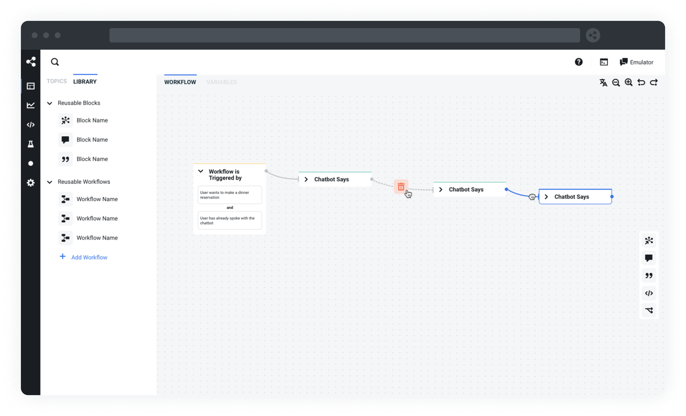

# [Botpress](https://botpress.com/?utm_source=github&utm_medium=organic&utm_campaign=botpress_repo&utm_term=readme) — The building blocks for building chatbots

## What is Botpress ?

Botpress is the standard developer stack to build, run and improve Conversational-AI applications. Powered by natural language understanding, a messaging API and a fully featured studio, Botpress allows developers around the globe to build remarkable chatbots without compromise.
a

**Out of the box, Botpress includes:**

- Administration panel to orchestrate and monitor your chatbots
- Conversation Studio to design a conversation, manage content, code custom integration
- Easy integration with messaging channels (Messenger, WhatsApp, Slack, Teams, Webchat, Telegram, SMS & more)
- Natural Language Understanding

## Getting Started

There are a few ways to get started with botpress :

- Download the latest binary for your OS [here](https://botpress.com/download?utm_source=github&utm_medium=organic&utm_campaign=botpress_repo&utm_term=readme) and follow the [installation docs](https://botpress.com/docs/installation).
- Use the official [Docker image](https://hub.docker.com/r/botpress/server) and follow the [hosting docs](https://botpress.com/docs/infrastructure/Docker)
- Deploy it in the cloud using these shortlinks:
   
- Run from sources, follow [build docs](https://botpress.com/docs/infrastructure/deploying)

## Documentation

- [Main Documentation](https://botpress.com/docs/introduction)
- [SDK Reference](https://botpress.com/reference/)
- [Code Examples](https://github.com/botpress/botpress/tree/master/examples)
- [Video Tutorials](https://www.youtube.com/c/botpress)

## Community

- [Community Forum](https://forum.botpress.com/) - Get community support and discuss your challenges
- [Issues](https://github.com/botpress/botpress/issues) - Report bug and file feature requests
- [Blog](https://botpress.com/blog) - How to's, Case studies & Announcements
- [Newsletter](https://botpress.activehosted.com/f/16) - Stay informed, subscribe to our news letter
- [Contributring](/.github/CONTRIBUTING.md) - Start contributing to Botpress
- [Partners](/.github/PARTNERS.md) - List of agencies who can help you with Botpress

## License

Botpress is dual-licensed under [AGPLv3](/licenses/LICENSE_AGPL3) and the [Botpress Proprietary License](/licenses/LICENSE_BOTPRESS).

By default, any bot created with Botpress is licensed under AGPLv3, but you may change to the Botpress License from within your bot's web interface in a few clicks.

For more information about how the dual-license works and why it works that way, please see the <a href="https://botpress.com/faq">FAQS</a>.
