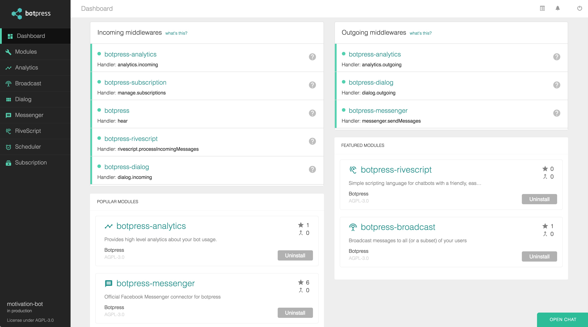
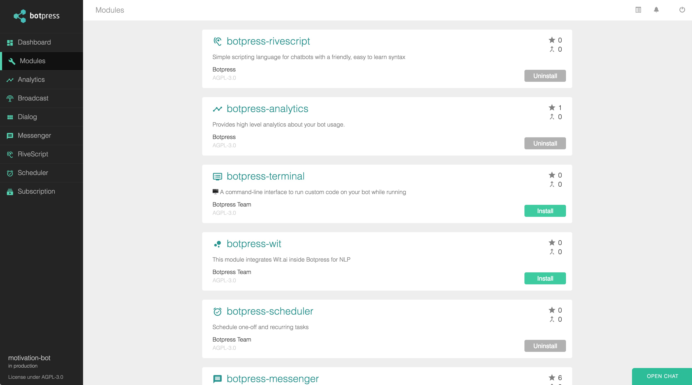

<a href='http://botpress.io'></a>
# <a href='http://botpress.io'></a>

Botpress is an open-source bot creation tool written in Javascript. It is powered by a rich set of open-source (and proprietary) modules built by the community. We like to say that **Botpress is like the Wordpress of Chatbots**; anyone can create and reuse other people's modules.

| 📖 [Documentation](https://docs.botpress.io) | ⚗️ [Cookbook](https://github.com/botpress/cookbook) | 🖥 [Website](https://botpress.io) | 💬 [Chatroom](https://gitter.im/botpress/core) | 📦 [Modules](https://www.npmjs.com/search?q=botpress) |
| ------------- | ------- | -------- | ------- | -------- |

## BETA TESTERS

Important: **Make sure to join the official Facebook Group (https://www.facebook.com/groups/656491441198667/)!**

## Vision & Mission

Botpress is on mission to make bots ubiquitous and profitable for everybody. At Botpress, we think that using closed-source tools like Chatfuel is not the right approach for building awesome and powerful bots. To be able to create something great, it's important to have full control of your tools and to leverage the community efforts as much as possible.

## Initial target audience

Botpress is at an early stage and we are looking for **nodejs developers** to build new modules, create chatbots and help the community to build something that will be huge... Over time, everyone will benefit from having a powerful open-source ecosystem with a wide variety of specialized modules.

If you are not a programmer or that this is your first bot, please consider using [Chatfuel](https://chatfuel.com/), [FlowXO](https://flowxo.com/) or [Motion.ai](http://motion.ai), these are great tools we recommend for begineers and for non-coders.


## <a name="what-it-looks-like"> What it looks like </a>





## Installation

Botpress requires [node](https://nodejs.org) (version >= 4.2) and uses [npm](https://www.npmjs.com) as package manager.

```
npm install -g botpress
```

## Creating a bot

Creating a bot is simple, you need to run [`botpress init`](/docs/cli-reference.md#init) in a terminal inside an empty directory:

```
mkdir my-bot && cd my-bot
botpress init
```

Once your bot is created, you need to run [`botpress start`](/docs/cli-reference.md#start--s) to start your bot:

```
botpress start
```

This will provide you locally a web interface available at **`http://localhost:3000`**

## Adding stuff to your bot

At this point, your bot does nothing, you need to add features. There's two ways to add features:
- Installing and configuring modules
- Coding

### Installing and configuring modules

For example, there's a `botpress-messenger` module that will make your bot connect to Facebook Messenger and easily send/receive messages.

You can install modules directly in the web interface, or using the [`botpress install`](/docs/cli-reference.md#install--i) command:

```
botpress install messenger
```

Once installed, modules expose two things:
- A graphical interface (available in the left panel). This makes configuration easy and convenient. You don't need to know about coding to use the graphical interface.
- Features via APIs. Each module has a detailed documentation on how to use their API.

There are not a lot of modules yet, we count on the community to develop many useful ones! Please [get in touch with us](https://gitter.im/botpress/core) if you would like to develop modules but you are not sure on how to get started.

### Coding to add features

As the number of modules increase, we expect that the amount of code you'll need to write will lower everyday. Developers can add code directly in the bot (i.e. `index.js`) and access the core and modules features. For example, if you wish to respond to a `GETTING_STARTED` event on Facebook Messenger, you might code something along these lines:

```js
bp.hear({ type: 'postback', text: 'GETTING_STARTED' }, (event, next) => {
  bp.messenger.sendText(event.user.id, 'Hello, human!')
})
```

For an overview of the core components, please read the [Basics](/docs/basics.md).

To create a basic Hello World bot, please read the [Getting Started](/docs/getting-started.md).

### Stats Collection

By default, anonymized usage statistics are sent to the Botpress Team. We rely on them to know where we need to allocate our efforts.

**Note**: we don't collect any personal information, we do not collect the content of the chats and nothing that could potentially breach your (or your user's) privacy. We use a one-way encryption algorithm to hash the data and we transmit them via a secure ssl connection. We also batch the data and make sure it won't slow down or interfere with your bot's performance.

#### Opting out of the stats collection

In your Botfile, simply set the `optOutStats` variable to `true`.

## Documentation

- [**Beginner's Guide** (start with this!)](/docs/getting-started.md)
- [Basics](/docs/basics.md)
- [Advanced Topics](/docs/advanced-topics.md)
- [CLI Reference](/docs/cli-reference.md)
- [Core Reference](/docs/core-reference.md)

## Examples

There's some tutorial that might help you getting started, it's easy to and it takes about less than 10 minutes.

- [Hello World Bot](https://github.com/botpress/botpress-examples/tree/master/hello-world-bot)
- [Hello World Bot using Rivescript](https://github.com/botpress/botpress-examples/tree/master/hello-world-rivescript-bot)
- [Motivation Bot](https://github.com/botpress/botpress-examples/tree/master/motivation-bot)

There's also some [videos on YouTube](https://www.youtube.com/channel/UCEHfE71jUmWbe_5DtbO3fIA) that shows how to create and code your bot using Botpress.

- [Create a Facebook Messenger chatbot in 3 minutes](https://www.youtube.com/watch?v=GO2yJ51ILl0)
- Todolist Bot _(soon)_
- Scheduling Messages _(soon)_
- Bot Analytics _(soon)_

Many more code examples are available in the [Examples repository](https://github.com/botpress/botpress-examples)

## Roadmap

The primary focus is to create as many good modules as possible to make Botpress the best platform for botmakers. Here are a couple of modules that would be useful along with their assigned leader:

| Module                                                                       | Maintainer
|-----------------------------------------------------------------------------|---------------------------
| **[botpress-wit.ai](https://github.com/botpress/botpress-wit)** | [@danyfs](https://github.com/danyfs)
| **[botpress-subscription](https://github.com/botpress/botpress-subscription)** | [@slvnperron](https://github.com/slvnperron)
| **[botpress-terminal](https://github.com/botpress/botpress-terminal)** | [@slvnperron](https://github.com/slvnperron)
| **[botpress-analytics](https://github.com/botpress/botpress-analytics)** | [@danyfs](https://github.com/danyfs)
| **[botpress-rivescript](https://github.com/botpress/botpress-rivescript)** | [@danyfs](https://github.com/danyfs)
| **[botpress-messenger](https://github.com/botpress/botpress-messenger)** | [@slvnperron](https://github.com/slvnperron)
| **[botpress-slack](https://github.com/botpress/botpress-slack)** | [@rayshih](https://github.com/rayshih)
| **[botpress-dialog](https://github.com/dialoganalytics/botpress-dialog)** | [@phildionne](https://github.com/phildionne)
| **[botpress-scheduler](https://github.com/botpress/botpress-scheduler)** | [@slvnperron](https://github.com/slvnperron)
| **botpress-inspector** | no body yet 
| **botpress-transcript** | [@rodrigocnascimento](https://github.com/rodrigocnascimento)
| **botpress-hitl** | [@danyfs](https://github.com/danyfs)
| **botpress-telegram** | no body yet 
| **botpress-kik** | no body yet
| **botpress-sms** | no body yet

## Contributing

For starters, there are [some open issues](https://github.com/botpress/botpress/issues?q=is%3Aissue+is%3Aopen+label%3Afor-new-contributors) with the `for-new-contributors` tag which are ideal for starting to contribute. They are all relatively easy to get started with.

If you would like to contribute any new feature or bug fix, please make sure that there is a GitHub issue first. If there is not, simply open one and assign it to yourself. If you are unsure on how to get started, ask us anything in the [Gitter chatroom](https://gitter.im/botpress/core) or email me at `contribute [AT] botpress.io`.

Contributions to Botpress will be dual-licensed under AGPLv3 and the Botpress Proprietary License.  This means that all contributors need to agree to the dual-license before their contributions can be accepted.

### Further ideas to work on
- **Bot templates**
- **Forms/Polls/Trivias**
- **Flows**
- **User Segmentation and targeting**
- **AI**
  - **Sentiment analysis**
  - **Context management**

**Your next module here :) ?** Please send a pull request!

## Community

There's a [public chatroom](https://gitter.im/botpress/core) where you are welcome to join and ask any question and even help others.

## License

Botpress is dual-licensed under [AGPLv3](/licenses/LICENSE_AGPL3) and the [Botpress Proprietary License](/licenses/LICENSE_BOTPRESS).

By default, any bot created with Botpress is licensed under AGPLv3, but you may change to the Botpress License from within your bot's web interface in a few clicks.
