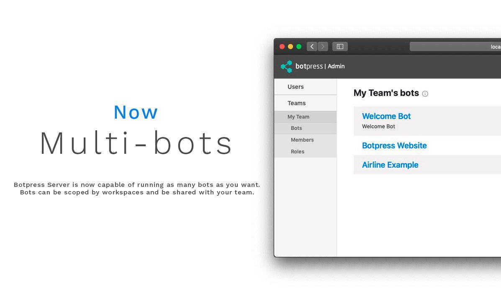
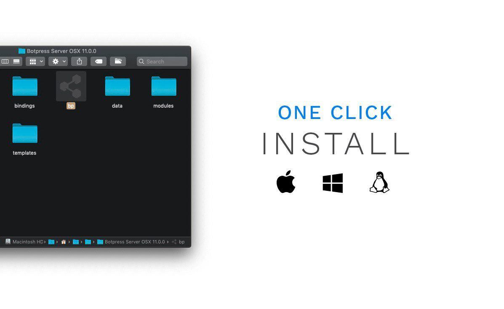

# [Botpress](https://botpress.io) — The open-source bot platform

Botpress is an open-source bot creation tool written in TypeScript. It is powered by a rich set of open-source modules built by the community. We like to say that **Botpress is like the WordPress of bots**; anyone can create and reuse other people's modules.

---

### About V11

#### ⚠️ Status

Botpress Server (v11) is currently in beta and is **not considered ready for production use** yet. If you are looking for the latest stable version, please [checkout Botpress v10.x](https://github.com/botpress/botpress/tree/archive/10.x).

#### What has changed

There are 3 major differences between Botpress X (10.x) and Botpress Server (11.x).

1. v11 is not an NPM library anymore – it is a standalone application. We distribute binaries of v11 for OSX, Windows, Linux and Docker on a daily basis.

2. v11 now supports multiple bots natively – thus the naming of Botpress Server.

3. v11 is a complete backend rewrite to TypeScript. We have made significant architectural changes that are not backward-compatible. _TODO: List of all changes_

---

##### Learn Botpress

| 📖 [v11 **Documentation**](https://botpress.io/docs) |
| ---------------------------------------------------- |

##### Follow us

| 🖥 [Website](https://botpress.io) | 💬 [Community](https://help.botpress.io) | 🚀 [Blog](https://botpress.io/blog) | 🐥 [Twitter](https://twitter.com/getbotpress) |
| -------------------------------- | ---------------------------------------- | ----------------------------------- | --------------------------------------------- |

## Support the project ⭐

If you feel awesome and want to support us in a small way, please consider starring and sharing the repo! This helps us get visability and allow the community to grow. 🙏

## Binaries

You can download the binaries [here](https://s3.amazonaws.com/botpress-binaries/index.html).

## What's New in Botpress Server

Botpress is on a mission to make useful bots ubiquitous by providing developers with cutting-edge tools to build & manage chatbots. We believe that in order to create great bots, significant time should be spent on user experience, **not** on the surrounding (and generic) features.

    

  

## Quick Start

**Prerequisites**: Node 10.11 (you can use [nvm](https://github.com/creationix/nvm)) and Yarn.

1. Run `yarn` to fetch node packages.
1. Run `yarn build` to build the core, the UI and the modules.
1. Run `yarn start` to start the server.

### Building issues

If you encounter errors when building modules (timeout, random errors, etc), try the following:

1. Go in each module folder and type `yarn && yarn build`

## Build the Botpress Pro Edition

To build the Pro Edition, set the environment variable `EDITION` or create an empty file named `pro` in the root folder.
This will fetch the pro submodule and build the app. By default, `yarn build` will target the Community Edition.

## Documentation

### Developer's Guide

We use [Docusaurus](https://docusaurus.io/en/) to create the Developer's Guide.

- To start the development server, run `yarn start:guide`
- To generate the static files, run `yarn build:guide`. The generated files will appear under `/docs/guide/build`
- To deploy a new version of the documentation, run `yarn run version <version here>`

### SDK Reference

We use [TypeDoc](https://github.com/TypeStrong/typedoc) to generate the SDK Reference directly from the source code.

- Run `yarn build:reference` to generate the documentation. THe static files will appear under `/docs/reference/public`.

## Contributing

Thank you for your interest in Botpress. Here are some of the many ways to contribute.

- Check out our [contributing guide](/.github/CONTRIBUTING.md)
- Check misspelling in our docs.
- Look at our [code of conduct](/.github/CODE_OF_CONDUCT.md)
- Engage with us on Social Media
  - Follow us on [Twitter](https://twitter.com/getbotpress)
- Answer and ask questions on the [Forum](https://help.botpress.io/)

For starters, there are some open issues with the [first good issue][starter-label] tag which are ideal for starting to contribute. They are all relatively easy to get started with.

Contributions to Botpress will be dual-licensed under AGPLv3 and the Botpress Proprietary License. This means that all contributors need to agree to the dual-license before their contributions can be accepted.

Please follow the [Conventional Commits](https://conventionalcommits.org/) specs when doing commits. **Pull requests not respecting this commit style will be rejected.**

## License

Botpress is dual-licensed under [AGPLv3](/licenses/LICENSE_AGPL3) and the [Botpress Proprietary License](/licenses/LICENSE_BOTPRESS).

By default, any bot created with Botpress is licensed under AGPLv3, but you may change to the Botpress License from within your bot's web interface in a few clicks.

For more information about how the dual-license works and why it works that way, please see the <a href="https://botpress.io/faq">FAQS</a>.

## Credits

Emoji provided free by [EmojiOne](http://emojione.com)

[starter-label]: https://github.com/botpress/botpress/issues?q=is%3Aopen+is%3Aissue+label%3A%22good+first+issue%22
