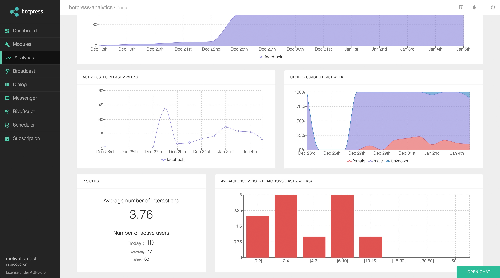

# [Botpress](https://botpress.io) — The open-source bot platform

Botpress is an open-source bot creation tool written in JavaScript. It is powered by a rich set of open-source modules built by the community. We like to say that **Botpress is like the WordPress of Chatbots**; anyone can create and reuse other people's modules.

##### Learn Botpress

| 📖 [v11 **Documentation**](https://botpress.io/docs) |
| ---------------------------------------------------- |

##### Follow us

| 🖥 [Website](https://botpress.io) | 💬 [Slack](https://slack.botpress.io) | 🚀 [Blog](https://botpress.io/blog) | 🐥 [Twitter](https://twitter.com/getbotpress) |
| -------------------------------- | ------------------------------------- | ----------------------------------- | --------------------------------------------- |

---

👉 Make sure you join our [Slack Community](https://slack.botpress.io) for help, announcements, gigs and fun!

## Support the project ⭐

If you feel awesome and want to support us in a small way, please consider starring and sharing the repo! This helps us getting known and grow the community. 🙏

## What is Botpress

Botpress is on a mission to make useful bots ubiquitous by powering developers with the best possible tools to build & manage chatbots. We believe that in order to create great bots, significant time should be spent on user experience, **not** on the surrounding (and generic) features.

## Binaries

You can download the binaries [here](TODO).

## Quick Start

1. Run `yarn` to fetch node packages.
1. Run `yarn bootstrap` to build the admin website and buid the app.
1. Run `yarn start` to start the server.

### Building issues

If you have errors when building modules (timeout, random errors, etc), try the following:

1. Set the environment variable GULP_SERIES=true before starting the build
1. If it doesn't work, go in each module folder and type `yarn && yarn build`

## Target a specific Botpress Edition

You can target a specific Botpress Edition when building the app. Just add the following environment variable: `EDITION=<ce|pro|ee> yarn build`. This will fetch the pro submodule and build the app. By default, `yarn build` will target the Community Edition.

## Documentation

### Developer's Guide

We use [Docusaurus](https://docusaurus.io/en/) to create the Developer's Guide.

- To start the development server, run `yarn start:guide`
- To generate the static files, run `yarn build:guide`. The generated files will appear under `/docs/guide/build`

### SDK Reference

We use [TypeDoc](https://github.com/TypeStrong/typedoc) the generate the SDK Reference directly from the source code.

- Run `yarn build:reference` to generate the documentation. THe static files will appear under `/docs/reference/`.

## Contributing

Thank you for your interest in Botpress. Here are some of the many ways to contribute.

- Check out our [contributing guide](/.github/CONTRIBUTING.md)
- Check misspelling in our docs.
- Look at our [code of conduct](/.github/CODE_OF_CONDUCT.md)
- Engage with us on Social Media
  - Follow us on [Twitter](https://twitter.com/getbotpress)
- Answer and ask questions on the [Forum](https://help.botpress.io/)

For starters, there are some open issues with the [first good issue][starter-label] tag which are ideal for starting to contribute. They are all relatively easy to get started with.

Contributions to Botpress will be dual-licensed under AGPLv3 and the Botpress Proprietary License. This means that all contributors need to agree to the dual-license before their contributions can be accepted.

Please follow the [Conventional Commits](https://conventionalcommits.org/) specs when doing commits. **Pull requests not respecting this commit style will be rejected.**

## License

Botpress is dual-licensed under [AGPLv3](/licenses/LICENSE_AGPL3) and the [Botpress Proprietary License](/licenses/LICENSE_BOTPRESS).

By default, any bot created with Botpress is licensed under AGPLv3, but you may change to the Botpress License from within your bot's web interface in a few clicks.

For more information about how the dual-license works and why it works that way, please see the <a href="https://botpress.io/faq">FAQS</a>.

## Credits

Emoji provided free by [EmojiOne](http://emojione.com)

[starter-label]: https://github.com/botpress/botpress/issues?q=is%3Aopen+is%3Aissue+label%3A%22good+first+issue%22
