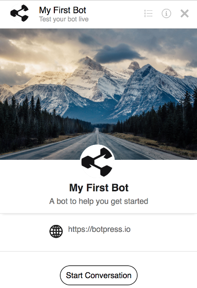
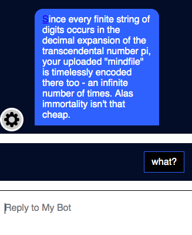

## Embedding

Embedding a chatbot to a website is relatively straightforward. As long as your chatbot is hosted on a physical or virtual server and is accessible via a URL, you can connect and embed it to a website. Add the following script tag to the end of your `index.html` (or the default webpage, whichever it's named).

> Remember to replace `<your-url-here>` with the URL of your bot!

```html
<script src="<your-url-here>/assets/modules/channel-web/inject.js"></script>
```

After the import script above, you need to locate and use the chatbot by initializing it to the `window` object:

```html
<script>
  window.botpressWebChat.init({ host: '<your-url-here>', botId: '<your-bot-id>' })
</script>
```

That's it! Once you add these changes and save them to your website, the bot will become available, and its button will appear on your site the next time you browse it.

There is an example in the default botpress installation at `http://localhost:3000/assets/modules/channel-web/examples/embedded-webchat.html`

### Additional Options

| Property | Description                                                              |
| -------- | ------------------------------------------------------------------------ |
| ref      | The trusted reference of the user origin (generated by [security sdk][]) |

## Bot Information page

The information page displays information like the website URL, a phone number, an e-mail contact address, and links to terms of services and privacy policies. You can also include a cover picture and an avatar for your bot.



How to set up the information page:

1. On the Admin UI, click on the link `Config` next to the name of the bot you want to change.
2. Edit your bot information in the `More details` and `Pictures` sections.
3. Edit the file `data/global/config/channel-web.json` and set `showBotInfoPage` to `true` **\*\***
4. Refresh your browser.

You will see the page when starting a new conversation. The page is always accessible by clicking on the information icon in the top right corner of the chat window.

> **\*\*** We edited the `global` configuration file for the sake of simplicity. To enable the bot information page on a single bot, visit that bot's studio UI and select **config** (the last icon on the left-side menu with a cog).

## Events Available

You can trigger events by calling the `window.botpressWebChat.sendEvent()` function. Below are some of them:

| name            | Description                                                       |
| --------------- | ----------------------------------------------------------------- |
| `show`          | This event opens the webchat                                      |
| `hide`          | This event closes the webchat                                     |
| `toggle`        | This event open or close the webchat depends on its current state |
| `message`       | This event sends a message (see example above)                    |
| `toggleBotInfo` | This event switches between bot infos and conversation page       |

### Show

The following function shows the chat window when you click the `show-bp` element.

```js
document.getElementById('show-bp').addEventListener('click', function() {
  window.botpressWebChat.sendEvent({ type: 'show' })
})
```

### Hide

The following function hides the chat window when you click the `hide-bp` element.

```js
document.getElementById('hide-bp').addEventListener('click', function() {
  window.botpressWebChat.sendEvent({ type: 'hide' })
})
```

### Changing Website Button

Most developers change the default webchat button which comes pre-packed in Botpress. This is the button that appears on your website (in the bottom right corner) when you embed your chatbot onto your website. This common styling change is usually applied to adopt a button which fits into the website theme. If you would like to change the default Botpress button, pass the `hideWidget` key to your `init` function. By so doing, the default chat button will not show up on your website.

```html
<script>
  window.botpressWebChat.init({ host: '<your-url-here>', botId: '<your-bot-id>', hideWidget: true })
</script>
```

You can then add a `click` event listener to any element on your web page (in most cases this entails creating a new button). Below is a code sample showing how to add event listeners to your custom elements.

```html
<script>
  document.getElementById('show-bp').addEventListener('click', () => {
    window.botpressWebChat.sendEvent({ type: 'show' })
    window.botpressWebChat.sendEvent({ type: 'message', text: 'Hello!' })
  })
  document.getElementById('hide-bp').addEventListener('click', () => {
    window.botpressWebChat.sendEvent({ type: 'hide' })
  })
</script>
```

### Toggle

The following function includes a ternary operator that toggles the chat to either be hidden or shown when you click the `toggle-bp` element.

```js
document.getElementById('toggle-bp').addEventListener('click', function() {
  window.botpressWebChat.sendEvent({ type: webchatOpen ? 'hide' : 'show' })
})
```

### Message

The following function lets you programmatically send a message to the user when you click the `send-message-bp` element.

```js
document.getElementById('send-message-bp').addEventListener('click', function() {
  window.botpressWebChat.sendEvent({ type: 'message', text: 'Hello!' })
})
```

### Obtaining visitor's User ID

The most widely used object property under events is `userId`. It fetches the current visitor ID to either save it in your database or update some Botpress DB attributes.

Since the webchat is running in an iframe, posting messages can achieve communication between frames. The chat will dispatch an event when a user id is set. You can listen for this event on your page.

```js
window.addEventListener('message', message => {
  if (message.data.userId) {
    console.log(`The User ID is ` + message.data.userId)
    //Add code to use the user ID here
  }
})
```

## Runtime configurations

The method `window.botpressWebChat.configure` allows you to change the chat's configuration during a conversation without having to reload the page.

The example below shows how you can change the chatbot's language to French when you click `change-lang-bp` on your website.

```js
document.getElementById('change-lang-bp').addEventListener('click', function() {
  lastConfig.locale = 'fr'
  window.botpressWebChat.configure(lastConfig)
})
```

### Sending Custom Payloads

All messages sent to a user consist of a `payload`. That payload has a `type` property that tells the webchat how the payload should render on the screen.

There are different ways to send that payload to the user:

- Sending a Content Element via the Flow Editor [example here](https://github.com/botpress/botpress/blob/master/modules/builtin/src/content-types/image.js)
- Sending an event via Hooks or Actions (https://github.com/botpress/botpress/blob/master/examples/custom-component/src/hooks/after_incoming_middleware/sendoptions.js)

There are multiple types already built-in in Botpress (these are listed at the bottom of this page), but you can create them easily if you require more advanced components.

### Prevent storing sensitive information

By default, the complete payload is stored in the database, so the information is not lost when the user refreshes the page. However, we may want to hide some properties deemed "sensitive" (ex: password, credit card, etc..).

To remove this information, there is a special property that you need to set: `sensitive`. Here's an example:

```js
const payload = {
  type: 'login_prompt',
  username: 'someuser',
  password: 'abc123',
  sensitive: ['password']
}

// This is the information that will be persisted: { type: 'login_prompt', username: 'someuser' }
```

### Changing avatar for messages

If you need to display a different bot's avatar for some of the messages (like imitating changing author), you can achieve that by setting `botAvatarUrl` like this:

```js
const payload = {
type: 'text',
botAvatarUrl: 'http://some.url'
text: 'Lorem ipsum'
}

```

## Creating a Custom Component

Creating a custom component allows you to display a different component on the webchat. For example, you could create a component to show a map to a user, you could display a form or add any other type of content.

A custom components has two parts:

- A bundle containing the actual component which will be displayed to the user
- a schema to tell Botpress what fields should be displayed in the content manager

Your schema must extend an existing content type, to ensure backward compatibility with channels other than channel-web

To get started:

1. Clone the studio repository: https://github.com/botpress/studio
2. Build the repository (`yarn && yarn build`)
3. Type `yarn cmd component:create --name your-component-name`
4. Open the directory displayed in the console, then type `yarn && yarn build`
5. Type `yarn package`
6. Run botpress, then open the code editor.
7. Next to `Components`, click the upload button, then select the `.tgz` archive which is in the folder created in step 4
8. Either restart the server or unmount/mount your bot

That's it ! The blank component will simply write "Hello world" in the webchat.

### Adding more fields

If you don't have any other value to provide to your component, you can simply extend `builtin_text` and work on the component in `ui/index.tsx`. Here is an example where we add 2 more fields to a component:

```js
const schema: CustomContentType = {
  extends: 'builtin_text',
  title: 'Info Source',
  jsonSchema: {
    description: 'A component to display the source of an information',
    properties: {
      url: {
        type: 'string',
        title: 'URL of the source'
      },
      lastUpdate: {
        type: 'string',
        title: 'When was the last update?'
      }
    }
  }
}

export default schema
```

On the content editor, you will have access to all the fields provided by the `builtin_text` component: message, typing, markdown, and you will also have your two fields: url and lastUpdate.

These properties will be available on your component:

```js
const Component = props => {
  return (
    <div>
      Hello world Source: {props.url} Last Update: {props.lastUpdate}
    </div>
  )
}

export default Component
```

Translations are supported, have a look here for an example: https://github.com/botpress/studio/tree/master/packages/components/info-source

Note: **The component will follow the bot when exported and imported elsewhere**

### Component Properties

A couple of properties are passed down to your custom component. These can be used to customize the displayed information and/or to pursue interactions.

| Property        | Description                                                                  |
| --------------- | ---------------------------------------------------------------------------- |
| ...props        | The payload properties are available on the root object (this.props.)        |
| onSendData      | This method can be used to send a payload to the bot on behalf of the user   |
| onFileUpload    | Instead of sending an event, this will upload the specified file             |
| sentOn          | This is the timestamp of the message.                                        |
| isLastGroup     | Indicates if your component is part of the group of messages sent by the bot |
| isLastOfGroup   | Indicates if your component is the last message in its group                 |
| keyboard        | This object allows you to manipulate the keyboard (more below)               |
| wrapped         | Represent any child components (more below)                                  |
| incomingEventId | The ID of the incoming event which was processed                             |
| store           | Grants access to the MOBX store of Channel Web (more on that below)          |

> isLastGroup and isLastOfGroup can be combined to let your component know if the current message is the last one the user is seeing. This can be used, for example, to display feedback buttons, a login form, or anything else, that will disappear when the user continues the discussion.

### The Store

The store orchestrates everything happening on the webchat: whether those buttons are displayed, which page is currently displayed, how to handle configuration changes, etc. This means that your component has a lot of flexibility. Here's a sample of the methods that you can use [click here to see all of them](https://github.com/botpress/botpress/tree/master/modules/channel-web/src/views/lite/store):

- Hide or Show the chat
- Add or Remove header buttons
- Change the size of the chat window
- Send messages or payloads
- Create a new conversation
- Update any configuration option
- Set a wrapper that will wrap every single message (more on that below)

Anything you can do while clicking on the UI can be done by your component.

### Injecting your components

Some components can be replaced by your own. There are also some placeholders that don't have any components, but you can inject yours. When you inject a component, it will receive the original component, so you can wrap it or change it completely. If there's a problem with your component, it will be replaced by the original one.

| Location           | Description                                                        |
| ------------------ | ------------------------------------------------------------------ |
| below_conversation | This component would be displayed just below the composer          |
| before_container   | This is displayed before the chat container (the debugger uses it) |
| composer           | This allows you to replace the zone where the user is typing       |

How to configure them:

```js
window.botpressWebChat.init({
...
  overrides: {
    before_container: [
      {
        module: 'extensions',
        component: 'Debugger'
      }
    ]
  }
})
```

### Wrappers

Wrappers allow you to transform a payload's content before passing it down to the renderer or another component. We have some [example components here](https://github.com/botpress/botpress/tree/master/examples/custom-component/src/views/lite/components/Advanced.jsx)

Here's an example of a wrapped text message:

```js
payload: {
  type: 'custom',
  module: 'myModule',
  component: 'MyComponent'
  wrapped: {
    type: 'text'
    text: 'Hello user!'
  }
}
```

It is also possible to chain multiple custom components using the `wrapped` property.

### Keyboards

The keyboard allows you to add elements before or after the composer. Keyboard items can be buttons or any other type of valid component. Use `Keyboard.Prepend` to display it before the composer, and `Keyboard.Append` to display it after.

"`js
...
render(){
// First of all, import the keyboard object
const Keyboard = this.props.keyboard

// Create any type of component
const something = <div>This will be displayed over the composer, as long as visible is true</div>

// Your custom keyboard will only be displayed if that message is the last one displayed
const visible = this.props.isLastGroup && this.props.isLastOfGroup

return (
<Keyboard.Prepend keyboard={something} visible={visible}>
This text will be displayed in the chat window
</Keyboard.Prepend>à
)
}

````

#### Using a Button Keyboard

There is a built-in hook that makes it easy to add buttons to any element. You can pass down an array of buttons or an array of array of buttons.

```js
const payload = {
  type: 'text'
  text: 'hello',
  quick_replies: [
      [{ label: 'row 1, button 1', payload: 'something' }, { label: 'row 1, button 2', payload: 'something' }],
      [{ label: 'row 2, button 1', payload: 'something' }],
      [{ label: 'row 3, button 1', payload: 'something' }]
    ]
}
````

[security sdk]: https://botpress.com/reference/modules/_botpress_sdk_.security.html#getmessagesignature

## Customizing Web Chat Style

The Botpress webchat interface which is displayed on your website is fully customisable. You can change any of the styling using CSS. This can be done in two steps. Firstly create your own cascading style sheet and name it anything you want. Thereafter paste your stylesheet in the `<botpress_dir>/data/assets/modules/channel-web` folder.

Secondly, you need to reference your new style sheet to your embedded cextrashatbot. You can easily do this by referencing your new stylesheet using the `extraStylesheet` property. Let us go through these steps in more detail.

### Step 1: Styling (CSS)

Paste the following CSS file in the `<botpress_dir>/data/assets/modules/channel-web` folder. Feel free to change the style here—original Botpress theme [can be found here](https://github.com/botpress/botpress/blob/master/modules/channel-web/assets/default.css).

```css
.bpw-from-bot .bpw-chat-bubble {
  background-color: #ececec;
}

.bpw-chat-bubble:last-of-type {
  border-bottom-right-radius: 20px;
  border-bottom-left-radius: 20px;
}

.bpw-chat-bubble:first-of-type {
  border-top-left-radius: 20px;
  border-top-right-radius: 20px;
}

.bpw-from-user .bpw-chat-bubble:last-of-type {
  border-bottom-right-radius: 0px;
}

.bpw-from-bot .bpw-chat-bubble:last-of-type {
  border-bottom-left-radius: 0px;
}

.bpw-from-user .bpw-chat-bubble {
  background-color: #4278f3;
  color: #ffffff;
}

.bpw-date-container .bpw-small-line {
  border-bottom: none;
}

.bpw-date-container {
  font-weight: 700;
  font-size: 14px;
}

.bpw-header-container {
  background-color: #f8f8f8;
  border-bottom: none;
}

.bpw-bot-avatar img,
.bpw-bot-avatar svg {
  border: none;
  border-radius: 50%;
}

.bpw-composer {
  padding: 10px;
  background: none;
  border: none;
}

.bpw-composer textarea {
  background: #ececec;
  border-radius: 20px;
  font-size: 1.25rem;
  overflow: hidden;
}

.send-btn {
  position: absolute;
  right: 30px;
  bottom: 28px;
  border: none;
  border-radius: 5px;
  background: #fff;
  padding: 5px;
  font-size: 14px;
  font-weight: 500;
  cursor: pointer;
}

.send-btn:hover {
  background: #d8d8d8;
}
```

### Step 2: Loading CSS File

Now, we need to instruct Botpress to use this custom CSS file for theming the webchat. For this, place the following code snippet in the `<botpress_dir>/data/global/hooks/after_bot_mount` folder. In our case, we used `01_create_shortlink.js` as the file name.

```js
const chatOptions = {
  hideWidget: true,
  config: {
    enableReset: true,
    enableTranscriptDownload: true,
    extraStylesheet: '/assets/modules/channel-web/chat.css'
  }
}

const params = {
  m: 'channel-web',
  v: 'Fullscreen',
  options: JSON.stringify(chatOptions)
}

setTimeout(() => {
  try {
    bp.http.deleteShortLink(botId)
  } catch (e) {}

  // Chatbot will be available at $EXTERNAL_URL/s/$BOT_NAME
  bp.http.createShortLink(botId, `${process.EXTERNAL_URL}/lite/${botId}/`, params)
}, 500)
```

Feel free to change the webchat config there; the critical line to keep is the `extraStylesheet` property.

### Result

Restart Botpress Server, and now your chatbot's default webchat will use your custom CSS theme! Here's our example:

