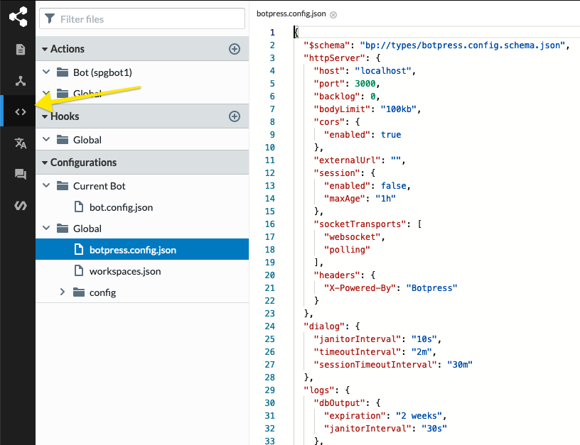
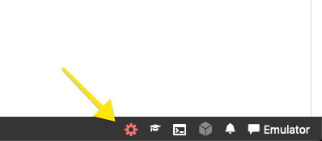

Docker is a set of platform-as-a-service products that use OS-level virtualization to deliver software in packages called containers.

> For an optimized Docker experience, download [Docker Desktop.](https://www.docker.com/products/docker-desktop)

## Using Remote Duckling & Language Server

This command will run Botpress within a single container and use the remote Duckling and Language Server hosted by us. You can get the latest `stable` or `nightly` versions on [DockerHub](https://hub.docker.com/r/botpress/server/tags).

> You should **never** use `nightly` versions in production because they are unstable.

```bash
docker run -d \
--name botpress \
-p 3000:3000 \
-v botpress_data:/botpress/data \
botpress/server:$TAG
```

For instance, you can run an installation as follows:

```bash
User@DESKTOP-T1ORLFU MINGW64 /c/Botpress/DockerTests
$ docker run -d \
> --name myBotpress \
> -p 3000:3000 \
> botpress/server:v12_18_2
Unable to find image 'botpress/server:v12_18_2' locally
v12_18_2: Pulling from botpress/server
32802c0cfa4d: Pulling fs layer
da1315cffa03: Pulling fs layer
fa83472a3562: Pulling fs layer
f85999a86bef: Pulling fs layer
26b3263a34bb: Pulling fs layer
7e33a4644769: Pulling fs layer
f85999a86bef: Waiting
26b3263a34bb: Waiting
7e33a4644769: Waiting
da1315cffa03: Download complete
fa83472a3562: Verifying Checksum
fa83472a3562: Download complete
f85999a86bef: Download complete
32802c0cfa4d: Download complete
32802c0cfa4d: Pull complete
da1315cffa03: Pull complete
fa83472a3562: Pull complete
f85999a86bef: Pull complete
26b3263a34bb: Verifying Checksum
26b3263a34bb: Download complete
26b3263a34bb: Pull complete
7e33a4644769: Verifying Checksum
7e33a4644769: Download complete
7e33a4644769: Pull complete
Digest: sha256:798b0fe332c5bb1b707eb62b30c8ed0a4e0609b3c712ee7201c5a7da7be50b7f
Status: Downloaded newer image for botpress/server:v12_18_2
bf038c6f84aaeec11773b93a9748bc6732d573a1c115523f1a3d28d20dc06cbe
```

You will be able to access your instance of Botpress on the specified mapped port `-p 3000:3000` by visiting http://localhost:3000/, and your container name will be myBotpress as set at `--name myBotpress`. Your Docker Desktop will reflect the new container as below:


Hosting Duckling and the Language Server is optional. Your Botpress installation will use our hosted services by default.

Choose to either run one of two containers (running two containers is recommended).

### Single Container With All Services

> ⚠️ **Never** run multiple processes inside a single container in production.

This method will run Duckling, the Language Server, and Botpress Server within the same container. It will set some environment variables so that services talk to each other.

```bash
docker run -d \
--name bp \
-p 3000:3000 -p 3100:3100 \
-v botpress_data:/botpress/data \
-e BP_MODULE_NLU_DUCKLINGURL=http://localhost:8000 \
-e BP_MODULE_NLU_LANGUAGESOURCES='[{ "endpoint": "http://localhost:3100" }]' \
botpress/server:$TAG \
bash -c "./duckling & ./bp lang --langDir /botpress/data/embeddings & ./bp"
```

**Offline Server**: Follow the Offline Server [instructions](#offline-servers) if you're running a server without Internet access.

### Running Multiple Containers

1. Run the Language Server.

```bash
docker run -d \
--name lang \
-p 3100:3100 \
-v botpress_data:/botpress/data \
botpress/server:$TAG \
bash -c "./bp lang --langDir /botpress/data/embeddings"
```

2. Run Botpress Server and Duckling within the same container. Duckling's usage is very light here, so we can justify using it in the same container as Botpress Server.

```bash
docker run -d \
--name bp \
-p 3000:3000 \
-v botpress_data:/botpress/data \
-e BP_MODULE_NLU_LANGUAGESOURCES='[{ "endpoint": "http://localhost:3100" }]' \
botpress/server:$TAG \
bash -c "./duckling & ./bp"
```

**Offline Server**: Follow the Offline Server [instructions](#offline-servers) if you're running a server without Internet access.

### Restarting Botpress

You can restart the server from Botpress UI. To achieve this, edit the `botpress.config.json` file from within The Code Editor module (located in the left sidebar). Botpress listens for changes to this config file.



After you have edited the botpress.config.json file, save it. You will now see an orange cog at the bottom right corner of the screen:



Click that button to restart the server. You can then inspect the logs using docker logs your_container_id.
