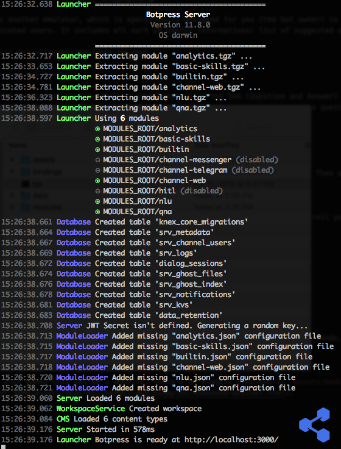
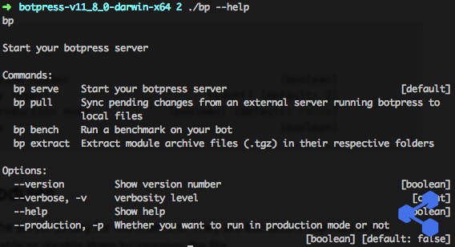

Getting started with Botpress is very easy. We build and distribute binaries of the latest stable version and we also have nightly builds of the master branch on Github.

## Download

The latest stable binaries are available for download [**here**](https://botpress.io/download). Alternatively, you may find all the versions and nightly builds in our public [**S3 Bucket**](https://s3.amazonaws.com/botpress-binaries/index.html).

## Installation

To install Botpress, simply unzip the file you download somewhere on your computer. Make sure that your computer has at least:

- Memory (RAM): Recommended 4 GB or above.
- Hard Drive: Recommended 64 GB of free space or above.
- A 64 bits architecture
- The right to read/write to the directory and subdirectories where Botpress is located

## Starting Botpress

### Executable

To start Botpress, all you have to do is double click on the `bp` file in the directory you extracted Botpress to.

Alternatively, you can also start it from the terminal:

```
> ./bp
```

The first time you run Botpress, the built-in modules take some time to install. This will only happen the first time you run Botpress, subsequent runs will be much faster.

Once the modules are installed and loaded, you should see something similar to the screenshot below.



### Commands

You may also start Botpress Server using the Command Line Interface (CLI). To see all the commands available, run `./bp --help`.


