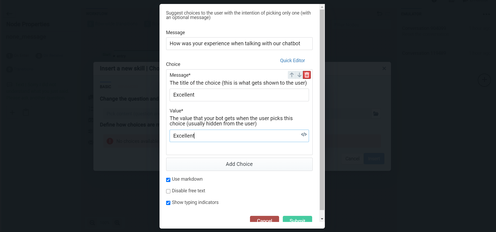

There are two ways of quickly adding custom code to enrich your bot's experience: **Actions** and **Hooks**.

Both are executed in a virtual machine to prevent server crashes in case there is a scripting error. Your scripts may require any module that is loaded by botpress by default (for example, lodash, axios, moment, nanoid, and [much more](https://github.com/botpress/botpress/blob/master/package.json)).

If you want to include other dependencies not already included, there are two possible ways. You can add the `node_modules` folder containing your dependency in the same folder as your Action, or you can [create a module](../advanced/custom-module) that includes your dependency.

To help you visualize how it works, check the snippet below. We've commented out a "hidden" portion of the code since all you need to include in your `.js` files is your actual code.

```js
/** const virtual_machine = async function action(bp: typeof sdk, event: sdk.IO.IncomingEvent, args: any, { user, temp, session } = event.state) { */

    //The content of your .js file starts here. Example:
    const _ = require('lodash')
    if (event.type === 'text') {
      const text = _.get(event, 'text')
      console.log(text)
      //...
    }
    //End of your file

/** } */
```

It is also possible to wrap your code with an async method:

```js
/** const virtual_machine = async function action(bp: typeof sdk, event: sdk.IO.IncomingEvent, args: any, { user, temp, session } = event.state) { */

    //The content of your .js file starts here. Example:
    const myMethod = async () => {
      await axios.get('...')
      console.log('Hello!')
    }

    return myMethod()
    //End of your file

/** } */
```

> These scripts have hot reloading enabled, which means that changes are picked up on the next function call whenever you edit it, making development a lot faster.

## Using Actions
Actions are server-side functions executed by the bot as part of a conversational flow. Actions have the power to do many things:

- Alter the state of the conversation
- Send customized messages to the conversation
- Execute arbitrary code like calling an API or storing data in the database

Since they are JavaScript functions, they can do pretty much anything. When the Dialog Manager (DM) invokes an Action, it gets passed the following arguments:

- `user`: All attributes of a user.
- `session`: Variables kept for the session's duration.
- `temp`: Variables that are alive only for the course of the flow.
- 'bot`: Object containing global variables for this bot (same for all users)
- `event`: The original (latest) event received from the user in the conversation.
- `args`: The arguments passed to this Action from the Visual Flow Builder.
- `process`: sandboxed VM containing some of the env-variables (starting with `EXPOSED_`)

Check out the page [Bot Memory and Data Retention](memory) for more details about these objects' lifetime.

### Example

Here are some possible ways to use these variables

```js
/** const virtual_machine = async function action(bp: typeof sdk, event: sdk.IO.IncomingEvent, args: any, { user, temp, session } = event.state) { */
user['firstname'] = 'Bob'
user['age'] = 17

temp = {
  text: 'hello there'
}

session.store = [{ id: 1, id: 2, id: 3 }]
/** } */
```

### Registering new actions
The only way to register new actions is to add your javascript code in a `.js` file and put them in the folder `data/global/actions`. There is no way to add new ones during runtime programmatically. You can also write actions directly in the Botpress Studio GUI by navigating to the code editor and using an Action Template.

We use JavaDoc comments to display meaningful information (name, description, arguments, default values) on the dialog flow editor. It is possible to keep an action hidden in the flow editor by adding the flag `@hidden true` in the JavaDoc.

## Built-In Actions
Botpress comes with a built-in set of Actions. For learning purposes, we will examine the most straightforward Action called Wait. It allows the developer to pause the bot before running the next instruction. For example, when the bot is about to present a long text message, the developer may use the `wait` action to simulate real typing.


### Wait Action
-  **Action Title** Wait/Delay
-  **Category** Utility
-  **Author** Botpress, Inc.
-  **Parameters** data_type:number name:delay (default = 1000) - The number of milliseconds to wait

```
const wait = async delay => {
  return new Promise(resolve => setTimeout(() => resolve(), delay))
}

return wait(args.delay || 1000)
```
As you can see, the Action is just a simple asynchronous arrow function that takes the number of milliseconds to `delay` as a parameter. When building an action, you can (and indeed should) specify the action type, its category, the author, and parameters.

### Append Context
-  **Action Title** Append Context
-  **Category** NLU
-  **Author** Botpress, Inc.
-  **1st Parameter** data_type:string name:contexts - Comma-separated list of contexts
-  **2nd Parameter** data_type:string name:[ttl=1] - Time-To-Live of the context in number of dialog turns. Put `0` to disable expiry.
This Action adds context(s) to the list of contexts used by the NLU Engine for subsequent messages for that chat session.

The TTL (Time-To-Live) is the time during which contexts are valid before automatic removal. For example, the default value of `1` will listen for that context only once (the next time the user speaks).
 
 If a context were already present in the list, the higher TTL would win.
 To override a specific context, use the `removeContext` action before this Action.
 
This method is contextual to the current user chat session. You can specify more than one context by separating them with a comma.

### Remove Context
-  **Action Title** Remove Context
-  **Category** NLU
-  **Author** Botpress, Inc.
-  **Parameter** data_type:string name:contexts - Comma-separated list of contexts

Use this Action to remove the provided context(s) from the list of contexts used by the NLU Engine for the next messages for that chat session.

This method is contextual to the current user chat session. You can specify more than one context by separating them with a comma.

### Reset Context
-  **Action Title** Reset Context
-  **Category** NLU
-  **Author** Botpress, Inc.
-  **Parameter** none

 It resets the NLU context to the default scope. This method is contextual to the current user and current chat session.

### Send Feedback
-  **Action Title** Send Feedback
-  **Category** NDU66
-  **Author** Botpress, Inc.
-  **Parameter**  data_type:number name:value - The feedback value. Use 1 for positive feedback, -1 for negative feedback

This Action sends feedback (1 for positive or -1 for negative feedback) at the end of a goal (a workflow that the user has completed)

### Get Global Variable
-  **Action Title** Get global variable
-  **Category** Storage
-  **Author** Botpress, Inc.
-  **1st Parameter** data_type:string name:name - The name of the variable
-  **2nd Parameter** data_type:string name:output - The state variable to ouput to

This Action retrieves a variable that was stored globally using a storage key. Botpress uses a `key: value` storage system to allow complex object storage definitions.

### Reset Global Variable
-  **Action Title** Reset Global Variable
-  **Category** Storage
-  **Author** Botpress, Inc.
-  **Parameter** data_type:string name:name - The name of the variable to be reset

Use this Action to reset a variable with global scope.

### Set Global Variable
-  **Action Title** Set global variable
-  **Category** Storage
-  **Author** Botpress, Inc.
-  **1st Parameter** data_type:string name:name - The name of the variable
-  **2nd Parameter** data_type:any name:value - Set the value of the variable
-  **3rd Parameter** data_type:string name:[expiry=never] - Set the expiry of the data, can be "never" or a short string like "6 hours"
-  **4th Parameter** data_type:string name:output - The state variable to output to.

This Action allows you to set a variable globally, with optional expiry.

### Set Variable
-  **Action Title** Set Variable
-  **Category** Storage
-  **Author** Botpress, Inc.
-  **1st Parameter** data_type:string name:type - Pick between: user, session, temp, bot
-  **2nd Parameter** data_type:string name:name - The name of the variable
-  **3rd Parameter** data_type:any name:value - Set the value of the variable. Type 'null' or leave empty to erase it.

You can use this Action to store data to desired storage based on the time to live expectation.

### Reset Session
-  **Action Title** Reset Session
-  **Category** Storage
-  **Author** Botpress, Inc.
-  **Parameter** none

This Action resets the user session and clears information stored in `temp` and `session` storage for the user. NLU Contexts and Last messages history isn't removed.

### Switch Language
-  **Action Title** Switch Language
-  **Category** Language
-  **Author** Botpress, Inc.
-  **Parameter** data_type:string name:lang - The language code, e.g. "en"

Useful for Pro License holders with multilingual bots, this Action lets you change the bot's language for the current user.

Botpress comes pre-packed with a translation engine that helps developers design a bot in one language while catering to users of all supported and configured languages.

## Hooks

Hooks are a handy way to execute actions when specific events occur.

They are defined globally as javascript files in the folder `data/global/hooks/${hookName}`. You can add as many files as you'd like in those; they will be processed sequentially, in alphabetical order.

> Note: subfolders are allowed but ignored in the ordering. If you have 02_hook.js and 03/01_hook.js, the order will be 01_hook.js then 02_hook.js

They all have access to the (Botpress SDK) [https://botpress.com/reference/](https://botpress.com/reference/).

### After Server Starts

This event is called once all modules and bots are loaded, and the bot is ready to accept incoming connections.

Location: `data/global/hooks/after_server_start`

Parameters: `bp`

### After Bot Mount

This event is called every time a bot is mounted, be it when the server starts up or when adding new bots at runtime.

Location: `data/global/hooks/after_bot_mount`

Parameters: `bp`, `botId`

### After Bot Unmount
Every time a bot is unmounted, Botpress calls this event to clean up after deleting a bot.

Location: `data/global/hooks/after_bot_unmount`

Parameters: `bp`, `botId`

### Before Incoming Middleware

Botpress calls this hook when an event is received, before any middleware. It is possible to change event properties.

Location: `data/global/hooks/before_incoming_middleware`

Parameters: `bp`, `event`

Botpress often uses this hook to set flags to skip some processing, for example, to prevent the module QNA from processing it when it's a quick reply:

```js
if (event.type === 'quick_reply') {
  event.setFlag(bp.IO.WellKnownFlags.SKIP_QNA_PROCESSING, true)
}
```

### After Incoming Middleware

This hook is called right after all incoming middlewares processed the event, but before the Dialog Engine starts processing it. You can access all the required data (including NLU intent) for special processing and decide what happens to the event.

Location: `data/global/hooks/after_incoming_middleware`

Parameters: `bp`, `event`

A typical operation here is to tell Botpress to ignore the event and not process it (e.g., not sending it to the dialog engine).
Here is an example:

```js
const messageTypesToDiscard = ['session_reset', 'typing', 'visit', 'session_reference']

if (messageTypesToDiscard.includes(event.type)) {
  event.setFlag(bp.IO.WellKnownFlags.SKIP_DIALOG_ENGINE, true)
}
```

### Before Outgoing Middleware

The Dialogue Manager calls this hook before the bot's reply is sent to the user.

Location: `data/global/hooks/before_outgoing_middleware`

Parameters: `bp`, `event`

Here you can save the bot's complete response.

### Before Session Timeout

This hook is called right before a user timeouts on a node.

Location: `data/global/hooks/before_session_timeout`

Parameters: `bp`, `event`

### Before Suggestions Election

This hook is called after the Decision Engine Ranking but before the Suggestion Election. Doing so allows you to override the Decision Engine's ranking by altering the `event.suggestions` array directly.

Location: `data/global/hooks/before_suggestions_election`

Parameters: `bp`, `event`, `suggestions`, `sessionId`

A typical operation here is to add a new (elected) suggestion when there is no elected winner.

## Disabling Hooks & Actions

Botpress will ignore files starting with a dot (`.`). This way, you can disable a hook or Action by merely prefixing the file's name with a dot.

## In-Built Skills

Botpress comes preloaded with some rudimentary skills. Let us look at these; we are confident that you will use them when building your next chatbot!

### Choice Skill
This skill is a spin-off from the realization that most chatbot conversations will eventually have a question with hardcoded choices as answers. Although there is a content element that lets the user select buttons to pick an answer, the choice skill adds a few more caveats to that content element, which we will explore here.



In addition to just letting you click a button and you are on your way, the choice skill adds a few checks and transitions to the process.

First of all, where freely typed responses are not disabled, the choice skill allows you to add responses which the user might type directly. This adds flexibility as the chatbot can understand and classify other responses besides the button click.


The choice skill also allows you to let the user have another go at answering the question asked. This is helpful in instances where the user might fail to perceive that a button response is required. It is also crucial in cases where the chatbot developer does not pre-empt the freely typed responses. 

When a user fails to respond, which the chatbot understands for whatever reason, they will be given a response guiding them on what to do when asked to answer the question again. 


The choice skill also offers an option to transition to a different node when the user repeatedly fails to answer the question being presented to them. This is useful when the user might not want to answer at all and express their own will, which is beyond the chatbot's scope of understanding, or is simply being stubborn.


