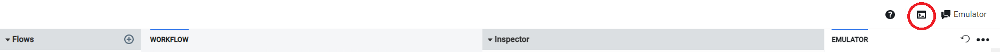
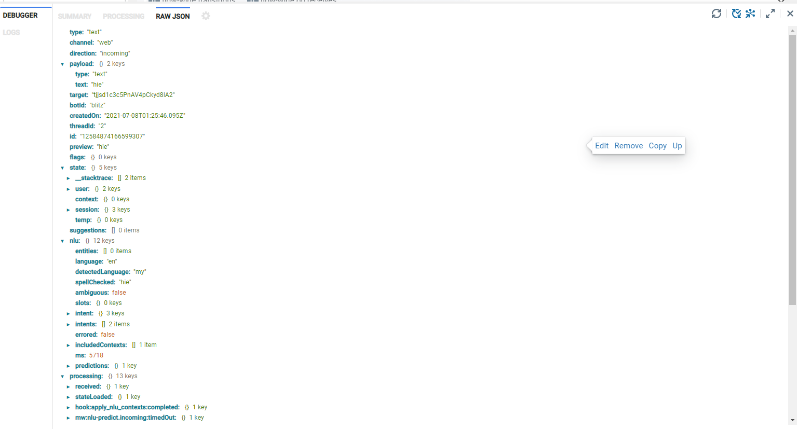
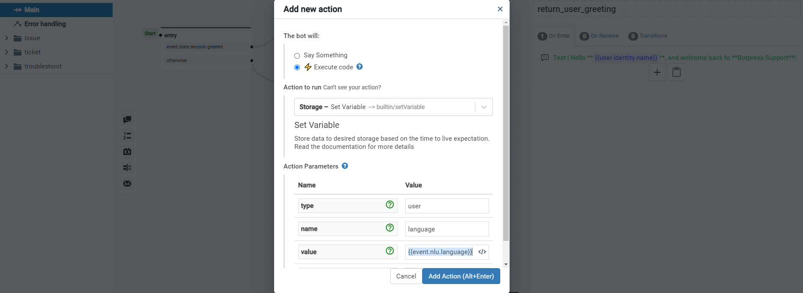
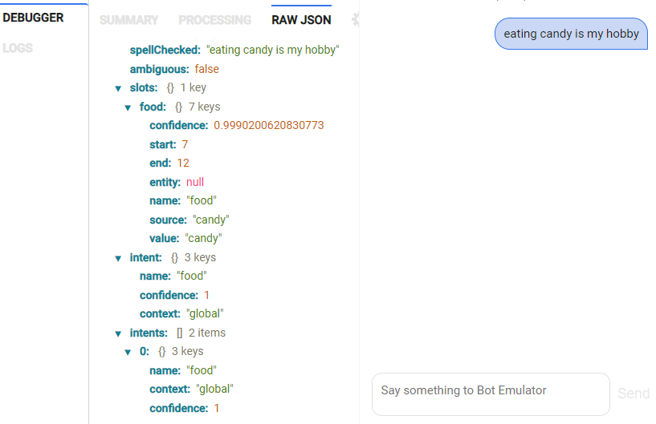
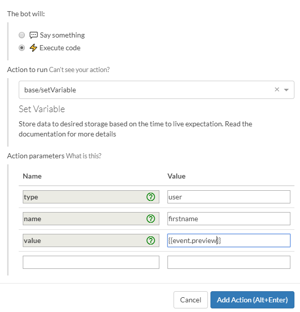

In a conversation, you may want to ask questions to the user and remember his answers to use later. You may also want to access the values of system parameters, such as the values of the slots that your chatbot just extracted.

## System Parameters

When a user talks to a chatbot, Botpress tracks all variables and parameters associated with that chatbot as the chatbot transitions from one state to another. If you run the debugger, you will see the tree of all the system parameters that it tracks. Just click the debugger button (circled in red below) and it will open in the bottom panel by default.



You can access these system parameters from the flow builder and within your code (including in Actions). To do so, all you need to do to reference a parameter by prefixing the path shown in the emulator with “event.”.

For example, the path shown in the debugger to the language parameter is nlu.language. You can reference that parameter by adding “event.” to the path shown in the debugger, i.e. event.nlu.language.



In the Flow Editor, you can access system parameters by bracketing them with two sets of curly brackets. For example, in a message, you could say:

> The user input language is {{event.nlu.language}}.

You can also set variables to be the value of a system parameter as follows:



For raw expressions or code (such as in Actions), you don't need the curly brackets. Here is an example of a raw expression in a transition:


In the same way, as described above, it would be possible to access the values of extracted slots by copying the path from the emulator and prefixing it with "event." i.e. {{state.session.slots.food.value}} in the flow builder and state.session.slots.food.value in code. "food" is a slot that was set up intent by the chatbot builder.



As is possible in Javascript, it is also possible to access the parameters with the following syntax:

{{state.session.slots["food"].value}}

System Parameters that do not appear in the emulator that may be useful to chatbot builders are:

event.payload.text - this returns the text just input by the user


## Variables

There are four different kinds of memories in Botpress; the difference between them is the duration and the scope.

- `user` memory is kept forever for the user it is associated with.
- `session` memory is kept for the duration of the configured session.
- `temp` memory is only kept for the duration of the flow.
- `bot` memory is the same value for all users of the same chatbot.

## Common Use Case

Most of the time, you will rely on the `user` and `temp` type of memory. The temp memory is only alive for the duration of a flow.

## Setting and accessing variables

Variables can be set up or declared using the Set Variable action (see Dialog Memory section below) or code. When using the Set Variable action dialog, the variable is set up and assigned a value.

In code, the variable is declared simply by using it. For example, if you type

**temp.user_name = "John"**

In code, the variable temp.user_name will be created and set to "John".

As with system parameters (see System Parameters section), variables can be accessed in the flow builder and the Set Variable dialog by bracketing the variables with double curly brackets as follows:

{{temp.user_name}}

[User Name Message]

In code or raw expressions, the reference to the variable would not need the double curly brackets.

For example, your chatbot would reference the variable as:

temp.user_name

[User Name Code]

## Dialog Memory

The Dialog Memory is how your chatbot will remember things in the context of a conversation. The way you can store and retrieve data is by using Actions inside the flows. There are four types of memory available: **user**, **session**, **temp** and **bot**. The value of type in the Set Variable user interface must be set to one of these four types.

You can consume a memory action just like any other action from the Botpress Flow Editor.

##### Memory Action Example



### User Memory

Variables set using the `user` namespace will be saved as attributes for the user. This means that those attributes will always follow the user, not notwithstanding conversations or periods.

When a user sends a message to the chatbot, the first middleware is tasked with loading that user's information. After everything is processed, any changes to the `user` object will be persisted in the database.

This means that you can alter the `user` object using middlewares and actions, and your chatbot will save it at the end.

#### User Memory - Data Retention

Since privacy is an important matter, a built-in system makes it dead-easy to set retention periods for different types of information. You could have, for example, a policy that says `email expires after two months` or `remember user's mood for one day`. Then, whenever the user's attribute is changed, the expiration policy is updated.

Here's how it could be configured:

```js
//data/global/botpress.config.json

dataRetention: {
  janitorInterval: '2m', // Check each 2 mins for expired data
  policies: {
    email: '60d', // Keep email for 30 days, reset if it is changed
    mood: '1d' // Forget user's mood after 1 day
    someChoice: '5m' // Keeps the variable alive for 5 minutes
  }
}
```

### Session Memory

The `session` store is alive for the duration of the user's session. How long is that? Well, it depends on the setting of `sessionIntervalTimeout` in `botpress.config.json`.

This is also where we keep the last messages sent by the user. This information is used by the Decision Engine to understand the user's will better and to avoid repeating meaningless stuff.

### Temporary Memory

The `temp` memory is the most frequently used type of memory in Botpress. This memory is kept from the beginning of flow until the end. As long as nodes are linked together, `temp` memory will be available. If you were a user of Botpress 10.x, this was better known as the `state` of the dialog.

Typical use cases include calling an action, saving the result in the `temp` memory, then send a content element including the answer to the user.

For example, you want to list the name of your servers, which your chatbot should fetch from an API.

This would be your action, fetch_servers.js:

```js
const listServers = async () => {
  try {
    const { data } = await axios.get(`https://mysite.com/servers`)
    temp.servers = data.servers.join(', ')
  } catch (error) {}
}

return listServers()
```

That action would fetch the name of your servers; then you could send a content element similar to this:

`Here's the list of our servers: {{temp.servers}}`

As you can see, it's straightforward to use!

### Bot Memory

The `bot` memory is the same value for all users of the chatbot. Think of it as a global variable but scoped to this chatbot only.

## How to change what's in the memory?

There are two different ways to edit these four different types of data. The most straightforward way is to use the action `base.setVariable`. You only have to specify the type of memory, the variable's name, and what value your chatbot should set it to.

Another common use is using actions. Actions allow you to edit these variables directly. For example, you could write `user.firstname = 'potato'` in your code file to update the user's name.

## General Storage

What if the four previous types of storage don't fulfill my requirements? Don't worry; we still have other options!

The Key-Value Store is a general-purpose store that allows you to store any data. You will need to manage expirations and data update yourself since Botpress will not update these values independently.

The KVS is available from the [Botpress SDK](https://botpress.com/reference/modules/_botpress_sdk_.kvs.html)
