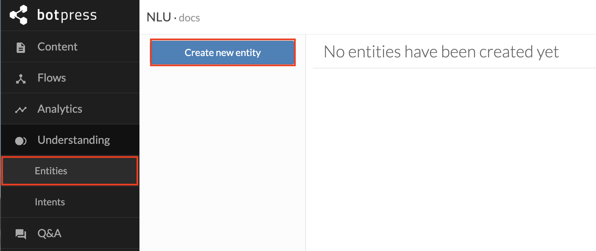
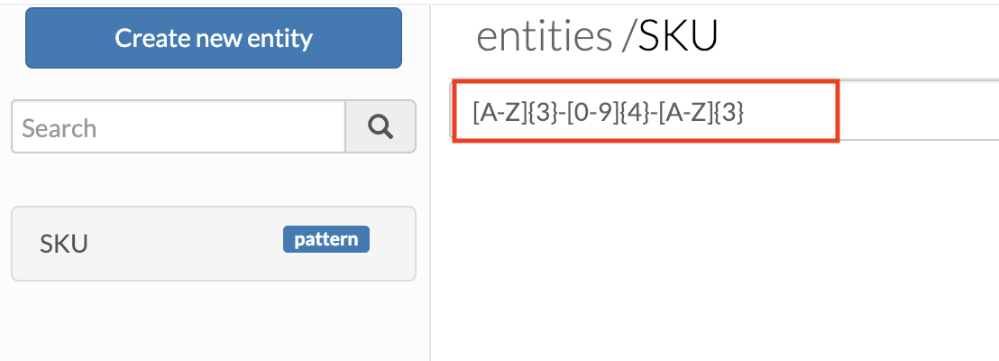
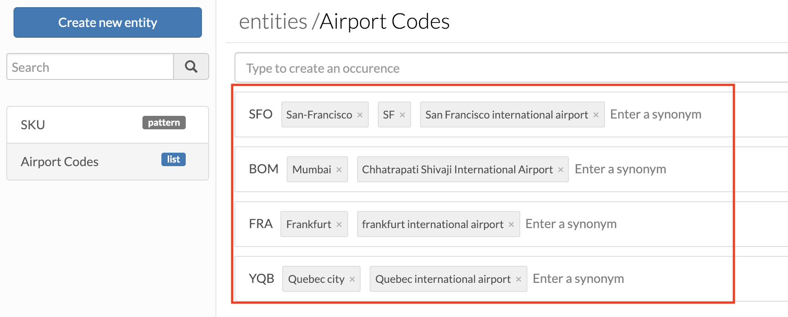

Entities are parts of a user phrase representing concepts such as color, date, time, or weight. So, in other words, entities are parameters to the intent. Thus, the `book-flight` intent may have an entity `destination` that specifies the city to be visited. Entity extraction helps you extract and normalize desired entities if they are present in a user phrase or message to the chatbot.

Attached to NLU extraction, you will find an entities property which is an array of [System](#system-entities) and [Custom](#custom-entities) entities.

## Using entities

You may access and use entity data by looking up the `event.nlu.entities` variable in your hooks, flow transitions, or actions.

### Example of extracted entity:

The user said: `Let's go for five miles run.`

```js
{
  /* ... other event nlu properties ... */
  entities: [
    {
      type: 'distance',
      meta: {
        confidence: 1
        provider: 'native',
        source: 'five miles', // text from which the entity was extracted
        start: 15, // beginning character index in the input
        end: 25, // end character index in the input
      },
      data: {
        value : 5,
        unit: 'mile',
        extras: {}
      }
    },
    {
      type: 'numeral',
      meta: {
        confidence: 1
        provider: 'native',
        source: 'five', // text from which the entity was extracted
        start: 15, // beginning character index in the input
        end: 19, // end character index in the input
      },
      data: {
        value : 5,
        extras: {}
      }
    }
  ]
}
```

> **Note**: In some cases, you will find additional structured information in the extras object

## System Entities

### Duckling extraction

Botpress Native NLU offers a handful of system entity extraction thanks to [Facebook/Duckling](https://github.com/facebook/duckling). This engine allows you to extract known entities like Time, Ordinals, Date, and so on. For a complete list of system entities, please head to [Duckling documentation](https://github.com/facebook/duckling).

 By default, Botpress uses an instance of Duckling hosted on our remote servers. If you don't want your data to be sent to our servers, you can either disable this feature by setting `ducklingEnabled` to `false` or host your duckling server and change the `ducklingURL` in the `data/global/config/nlu.json` config file.

Please check the [Deployment](../infrastructure/hosting) section for instructions on hosting your Duckling server.

#### Example

|             User said             |    Type    | Value |  Unit   |
| :-------------------------------: | :--------: | :---: | :-----: |
| _"Add 5 lbs of sugar to my cart"_ | "quantity" |   5   | "pound" |

```js
{
  type: 'quantity',
  meta: {
    confidence: 1,
    provider: 'native',
    source: '5 lbs', // text from which the entity was extracted
    start: 4, // beginning character index in original input
    end: 9, // end character index in original input
  },
  data: {
    value : 5,
    unit: 'pound',
    extras: {}
  }
}
```

> **Note**: Confidence will always be one due to the rule-based implementation of Duckling

## Custom Entities
Botpress provides two types of custom entities: [pattern](#pattern-extraction) and [list](#list-extraction) entities. To define a custom entity, go to the **Entity section** of the NLU Module interface accessible from the Botpress studio sidebar. From there, you can define your custom entities which will be available for any input message treated by your chatbot. Go ahead and click on **create new entity**



### Pattern extraction
Pattern or Regular Expression Extraction allows you to extract information presented in a format that can be described using Regular Expression (RegEx). Once you've created a pattern entity, Botpress Native NLU will perform a regex extraction on each incoming message and add it to `event.nlu.entities`.

#### Example :

Given a Pattern Entity definition with `[A-Z]{3}-[0-9]{4}-[A-Z]{3}` as pattern:



Extraction will go like this:

|           User said           | Type  |     Value      |
| :---------------------------: | :---: | :------------: |
| _"Find product BHZ-1234-UYT"_ | "SKU" | "BHZ-1234-UYT" |

```js
{ name: 'SKU',
  type: 'pattern',
  meta:
   { confidence: 1,
     provider: 'native',
     source: 'BHZ-1234-UYT',
     start: 13,
     end: 25,
     raw: {} },
  data: {
    extras: {},
    value: 'BHZ-1234-UYT',
    unit: 'string'
    }
}
```

### List extraction

List extraction behaves similarly to pattern extraction. However, you'll be able to add different **occurrences** of your entity with corresponding synonyms.

Let's take **Airport Codes** as an example:



Extraction will go like this:

|              User said               |      Type       |     Value      |
| :----------------------------------: | :-------------: | :------------: |
| _"Find a flight from SFO to Mumbai"_ | "Airport Codes" | ["SFO", "BOM"] |

```js
;[
  {
    name: 'Airport Codes',
    type: 'list',
    meta: {
      confidence: 1,
      provider: 'native',
      source: 'SFO',
      start: 19,
      end: 22,
      raw: {}
    },
    data: {
      extras: {},
      value: 'SFO',
      unit: 'string'
    }
  },
  {
    name: 'Airport Codes',
    type: 'list',
    meta: {
      confidence: 1,
      provider: 'native',
      source: 'Mumbai',
      start: 26,
      end: 32,
      raw: {}
    },
    data: {
      extras: {},
      value: 'BOM',
      unit: 'string'
    }
  }
]
```

## Placeholder extraction
Botpress Native NLU also has a system entity of type `any`, which is essentially a placeholder. For this feature to work optimally, a lot of training data is required. Before identifying slots [see slots docs](#slots) as entity type `any`, try to use custom entities.

An example of a placeholder entity would be: Please tell **Sarah** that **she's late**

For placeholder extraction, please take note of the points below.
- When using a slot with system.any - Capitalization matters
- The any-type slots try to generalize, without any help from patterns and existing keywords, so they look for:
- The size of the words
- The surrounding words
- Whether the first letter is capital
- Whether all the letters are capital or not
- The presence of punctuation or symbols (like hyphens)
- The meaning of the word VS the other vocabulary
 
Consider that the any-type slot should be used as the last resort and requires at least ten times as much data as any other form of entity extraction via slots. 

## Sensitive Information
Messages sent between users and the chatbot are stored in the database, which means that sometimes your chatbot may save personal information (e.g., a credit card number) as well. To protect the chatbot user's confidential information, use the small checkbox located in the upper right corner labeled `sensitive` when creating such entities.

When checked, your chatbot will still display the information in the chat window, but the sensitive information will be replaced by `*****` before being stored. The original value is still available from `event.nlu.entities`
