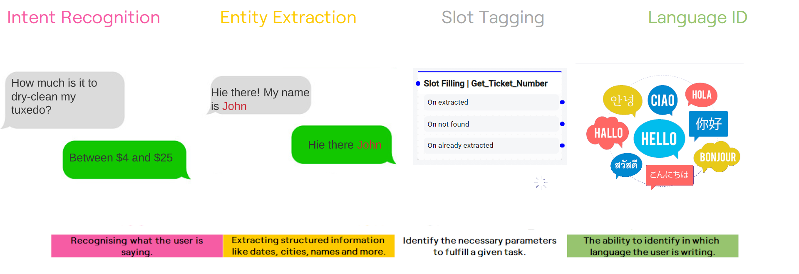

Natural language understanding is a branch of AI that interprets and understands text from a user then converts the text into a usable format for computers. For example, Botpress' NLU transforms natural dialog from the user into structured information that your chatbot can understand and use. 

The information generated by NLU tasks is added to the message metadata directly (under `event.nlu`), ready to be consumed by other modules and components.

## Main Tasks
Below are some tasks performed by the NLU module

 > **QnA**: A simple use-case for bots is to understand a question and provide an answer automatically. Doing that manually for all the questions and answers using the NLU module and the flow editor would be a tedious task, which is why we recommend using the QnA module for that instead.

### Intent Recognition
It’s about recognizing what the user is saying. For example, if the user asks, “Can I take my cat to fly with me on the airplane?” you can train the bot to understand that the user is asking about flying with pets and give the appropriate answer.

### Entity Extraction
Entity extraction involves extracting structured information from messages like dates, time, cities, names, and many more. For example, if the user says, “I want to fly from New York to Montreal on 8 March”, we can extract the city names and the date. We generally define entities in the form of patterns or lists.

### Slot Tagging
Slot tagging is needed to identify the necessary parameters to fulfill a given task. If we take the same example, we want to save the city names in parameters **Airport from** and **Airport to** and the date in a parameter like **Travel date** to use these parameters in our workflows. 

### Language Identification 
Language identification is the ability to identify in which language the user is writing. In Botpress, we have many predefined language modules, like English, French, Arabic, German, and many more. You can even add your language model if we don’t have it already, or you can make use of third-party software to do autotranslations.

Botpress NLU comes with the ability to identify the language in which the user is writing if it is one of the predefined languages. But keep in mind that the best practice for user experience is to confirm the language with the user at the start and then stick to the same language throughout the conversation

## Language Server
The language server provides additional information about words, which allows your chatbot to understand words with similar meanings. It takes away the need for you to teach your chatbot about synonyms and colloquial language. By default, your Botpress server will query one of our language servers for that purpose. You can also choose to host your server if you would like to keep everything on your premises. Head over to the [Hosting](../infrastructure/hosting#running-your-language-server) page for more details.

## External NLU Providers
Botpress NLU ships with a native NLU engine (Botpress Native NLU). The advantage of using Botpress NLU is that it is fast (both at training and evaluation time), secured (doesn't relay messages to external services), predictable (you can write unit tests, and the model resides on your computer or server), and free.

If you want to use an external provider for some reason, you can do so by using [Hooks](code#hooks) and calling the external NLU provider via API. There's a detailed example [here](../nlu/3rd-party-NLU)

> **Note**: We have dropped support [(see why)](https://github.com/botpress/botpress/pull/1170) for two-way synchronization as there were too many issues in doing (and maintaining) that. You'll have to maintain this yourself if you go this way. We're open to contributions for both implementation and maintenance of 3rd party NLU integrations.

### Features by Providers
|  Provider  | Intent | Entity | Slot tagging | Lang | Context | Sentiment |
| :--------: | :----: | :----: | :----------: | :--: | :-----: | :-------: |
|   Native   |   X    |   X    |      X       |  X   |    X    |           |
| DialogFlow |   X    |   X    |      X       |      |    X    |           |
|    Luis    |   X    |   X    |              |      |         |     X     |
|   Recast   |   X    |   X    |              |  X   |         |     X     |
|    Rasa    |   X    |   X    |              |      |         |           |
