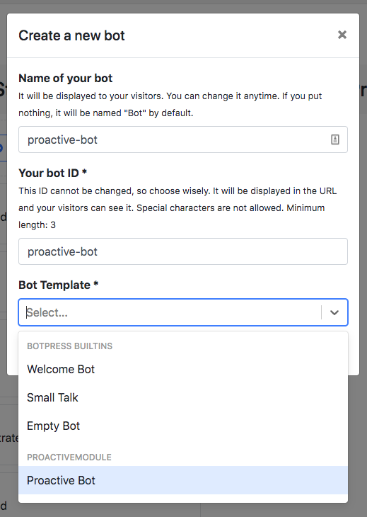

# README

This is a module that you can install to play around with proactive triggers.

You can learn more about proactive messages [here](https://botpress.com/docs/tutorials/proactive/).

## Installation

1. Copy-paste this folder into the `modules` folder
1. [Enable](https://botpress.com/docs/main/module#enabling-or-disabling-modules) the module
1. Build the module: `cd modules/proactive && yarn && yarn build`
1. Start Botpress: `cd ../.. && yarn start`
1. Create a new bot using the "Proactive Bot" template from the bot templates list and name it `proactive-bot`:
   
1. Go to http://localhost:3000/assets/modules/proactive-module/ or <you_url>/assets/modules/proactive-module/
