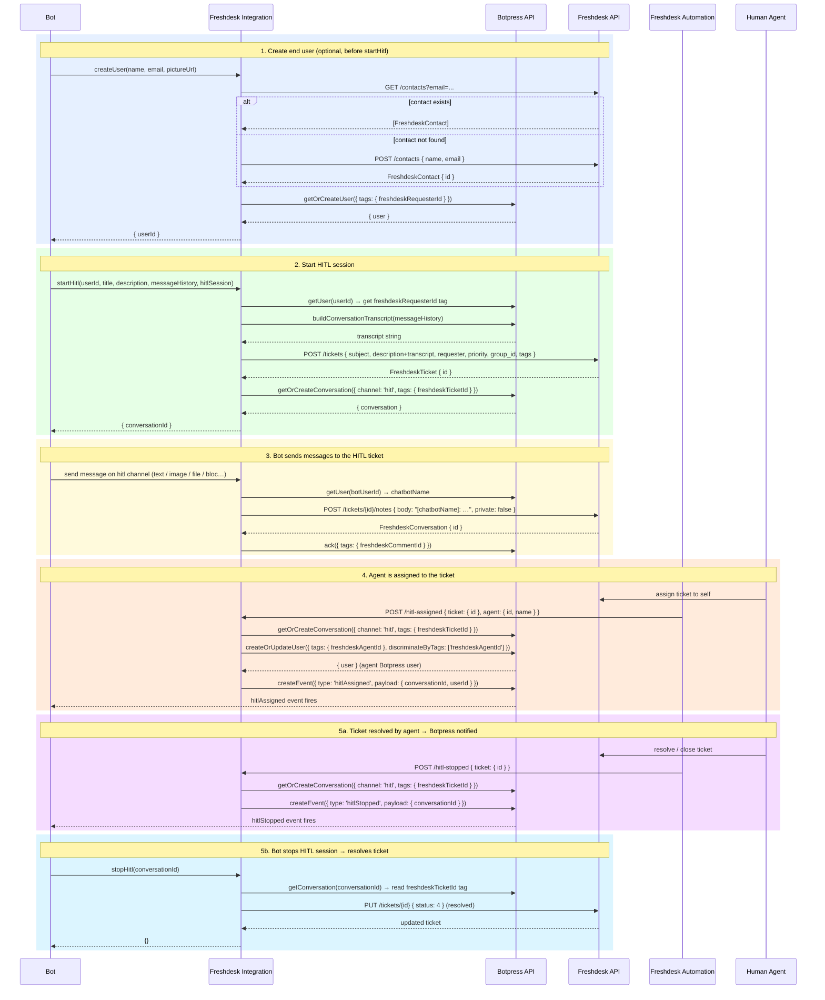

```mermaid
sequenceDiagram
    participant Bot
    participant FreshdeskIntegration as Freshdesk Integration
    participant BotpressAPI as Botpress API
    participant FreshdeskAPI as Freshdesk API
    participant Automation as Freshdesk Automation
    participant Agent as Human Agent

    rect rgb(230, 240, 255)
        Note over Bot,FreshdeskAPI: 1. Create end user (optional, before startHitl)
        Bot->>FreshdeskIntegration: createUser(name, email, pictureUrl)
        FreshdeskIntegration->>FreshdeskAPI: GET /contacts?email=...
        alt contact exists
            FreshdeskAPI-->>FreshdeskIntegration: [FreshdeskContact]
        else contact not found
            FreshdeskIntegration->>FreshdeskAPI: POST /contacts { name, email }
            FreshdeskAPI-->>FreshdeskIntegration: FreshdeskContact { id }
        end
        FreshdeskIntegration->>BotpressAPI: getOrCreateUser({ tags: { freshdeskRequesterId } })
        BotpressAPI-->>FreshdeskIntegration: { user }
        FreshdeskIntegration-->>Bot: { userId }
    end

    rect rgb(230, 255, 230)
        Note over Bot,FreshdeskAPI: 2. Start HITL session
        Bot->>FreshdeskIntegration: startHitl(userId, title, description, messageHistory, hitlSession)
        FreshdeskIntegration->>BotpressAPI: getUser(userId) → get freshdeskRequesterId tag
        FreshdeskIntegration->>BotpressAPI: buildConversationTranscript(messageHistory)
        BotpressAPI-->>FreshdeskIntegration: transcript string
        FreshdeskIntegration->>FreshdeskAPI: POST /tickets { subject, description+transcript, requester, priority, group_id, tags }
        FreshdeskAPI-->>FreshdeskIntegration: FreshdeskTicket { id }
        FreshdeskIntegration->>BotpressAPI: getOrCreateConversation({ channel: 'hitl', tags: { freshdeskTicketId } })
        BotpressAPI-->>FreshdeskIntegration: { conversation }
        FreshdeskIntegration-->>Bot: { conversationId }
    end

    rect rgb(255, 250, 220)
        Note over Bot,FreshdeskAPI: 3. Bot sends messages to the HITL ticket
        Bot->>FreshdeskIntegration: send message on hitl channel (text / image / file / bloc…)
        FreshdeskIntegration->>BotpressAPI: getUser(botUserId) → chatbotName
        FreshdeskIntegration->>FreshdeskAPI: POST /tickets/{id}/notes { body: "[chatbotName]: …", private: false }
        FreshdeskAPI-->>FreshdeskIntegration: FreshdeskConversation { id }
        FreshdeskIntegration->>BotpressAPI: ack({ tags: { freshdeskCommentId } })
    end

    rect rgb(255, 235, 220)
        Note over Agent,Bot: 4. Agent is assigned to the ticket
        Agent->>FreshdeskAPI: assign ticket to self
        Automation->>FreshdeskIntegration: POST /hitl-assigned { ticket: { id }, agent: { id, name } }
        FreshdeskIntegration->>BotpressAPI: getOrCreateConversation({ channel: 'hitl', tags: { freshdeskTicketId } })
        FreshdeskIntegration->>BotpressAPI: createOrUpdateUser({ tags: { freshdeskAgentId }, discriminateByTags: ['freshdeskAgentId'] })
        BotpressAPI-->>FreshdeskIntegration: { user } (agent Botpress user)
        FreshdeskIntegration->>BotpressAPI: createEvent({ type: 'hitlAssigned', payload: { conversationId, userId } })
        BotpressAPI-->>Bot: hitlAssigned event fires
    end

    rect rgb(245, 220, 255)
        Note over Agent,Bot: 5a. Ticket resolved by agent → Botpress notified
        Agent->>FreshdeskAPI: resolve / close ticket
        Automation->>FreshdeskIntegration: POST /hitl-stopped { ticket: { id } }
        FreshdeskIntegration->>BotpressAPI: getOrCreateConversation({ channel: 'hitl', tags: { freshdeskTicketId } })
        FreshdeskIntegration->>BotpressAPI: createEvent({ type: 'hitlStopped', payload: { conversationId } })
        BotpressAPI-->>Bot: hitlStopped event fires
    end

    rect rgb(220, 245, 255)
        Note over Bot,FreshdeskAPI: 5b. Bot stops HITL session → resolves ticket
        Bot->>FreshdeskIntegration: stopHitl(conversationId)
        FreshdeskIntegration->>BotpressAPI: getConversation(conversationId) → read freshdeskTicketId tag
        FreshdeskIntegration->>FreshdeskAPI: PUT /tickets/{id} { status: 4 } (resolved)
        FreshdeskAPI-->>FreshdeskIntegration: updated ticket
        FreshdeskIntegration-->>Bot: {}
    end
```
