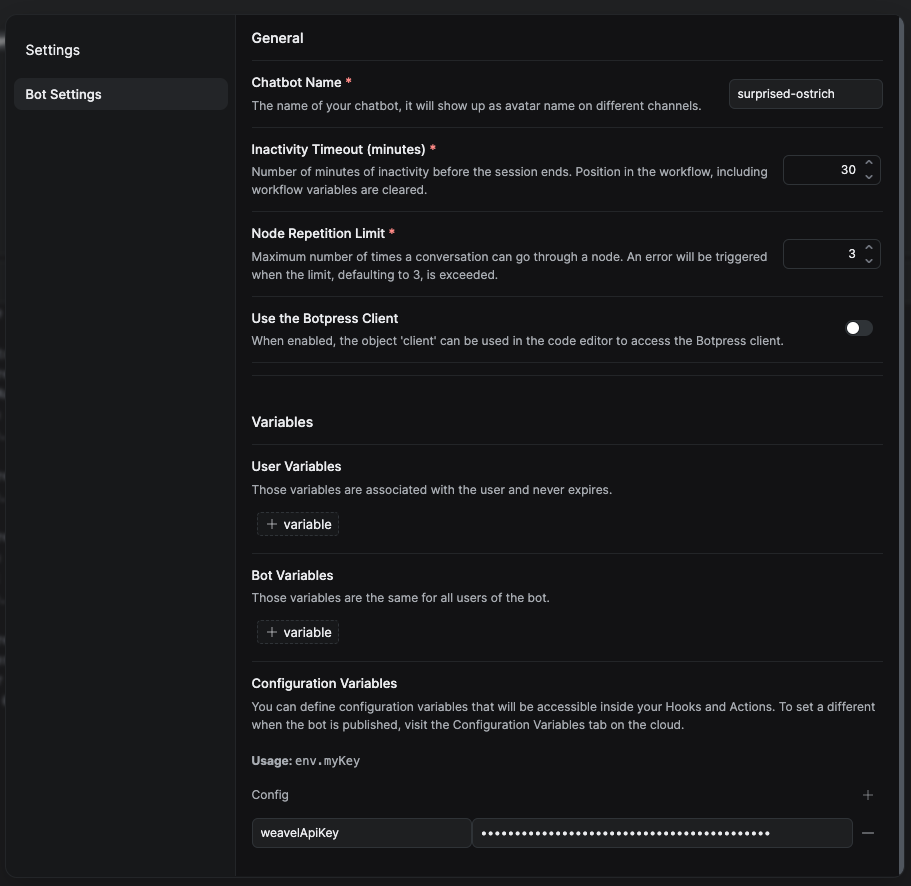
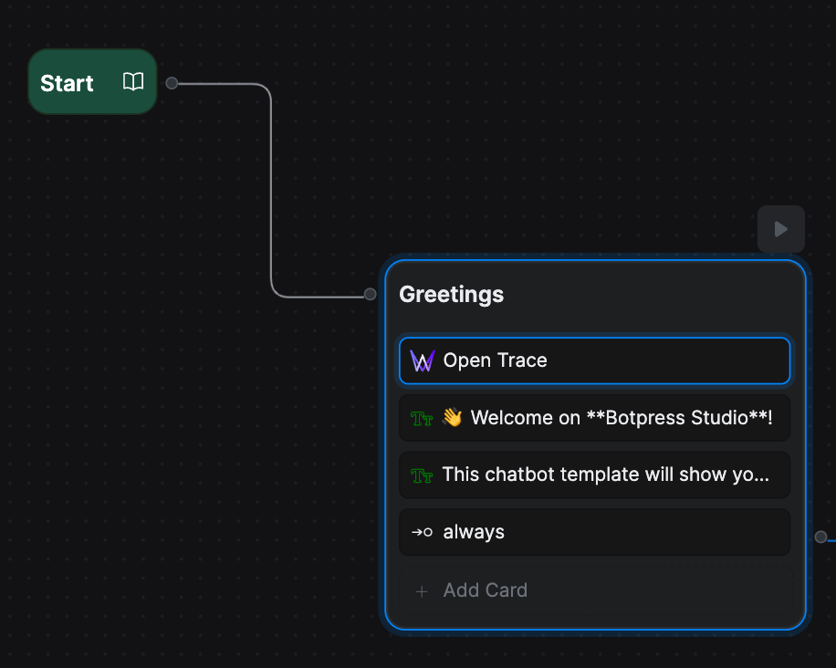

This integration allows you to connect your Botpress chatbot with Weavel, a powerful analytics platform for conversational AI. By integrating your chatbot with Weavel, your chatbot's conversations will be automatically captured and analyzed with Weavel's AI, and configurable reports will be generated to help you understand your chatbot's performance and user behavior.

## Setup

To establish this integration, the following is required:

- Authorized access to an existing Weavel project. If you don't have an existing account, you can sign up for free [here](https://weavel.ai).
- A valid Weavel project API key.

After the setup, you should follow the instructions on _Prerequisites_ to ensure all of your chatbot's conversation data is properly captured by Weavel. You can also make use of the **Capture track event** action in your chatbot for advanced product analytics.

## Prerequisites

Before activating the Botpress Weavel Integration, please walk through the following steps:

### First, add the Weavel API key to your bot's configuration.

Add your Weavel project API key to your chatbot's configuration variables. This is required to make it accessible to the hooks you will add in the next step.



### Second, add two hooks into your chatbot.

> **Note:** You can add hooks in the "Hooks" section of your chatbot's admin panel.
> 

Create a new hook under the "After Incoming Message" section, and add the following code:

```typescript
try {
  const userMessage = event.preview
  await axios.post(
    'https://api.weavel.ai/capture/trace_data',
    {
      trace_id: event.conversationId,
      user_id: event.userId,
      role: 'user',
      content: userMessage,
      metadata: {
        event: event,
      },
    },
    {
      headers: {
        Authorization: `Bearer ${event.state.configVariables['weavelApiKey']}`,
      },
    }
  )
} catch (error) {
  console.log(error)
}
```

Next, create another hook under the "Before Outgoing Message" section, and add the following code:

```typescript
try {
  let assistantMessage: string
  if (outgoingEvent.payload.type == 'text') {
    assistantMessage = outgoingEvent.preview
  } else {
    assistantMessage = `${outgoingEvent.payload.type}: ${JSON.stringify(outgoingEvent.payload)}`
  }

  const data = {
    trace_id: event.conversationId,
    user_id: event.userId,
    role: 'assistant',
    content: assistantMessage,
    metadata: {
      event: event,
    },
  }

  await axios.post('https://api.weavel.ai/capture/trace_data', data, {
    headers: {
      Authorization: `Bearer ${event.state.configVariables['weavelApiKey']}`,
    },
  })
} catch (error) {
  console.log(error)
}
```

### Last, add an action card to your chatbot's flow.

Add the _"Open Trace"_ event at the beginning of your chatbot's flow.



This step is mandatory for the hooks to work properly.

## Usage

With the integration enabled, Weavel will analyze your chatbot's conversations and generate reports to help you understand your chatbot's performance and user behavior. To learn more about Weavel's capabilities and how to use the reports, refer to the [Weavel documentation](https://weavel.ai/docs).
