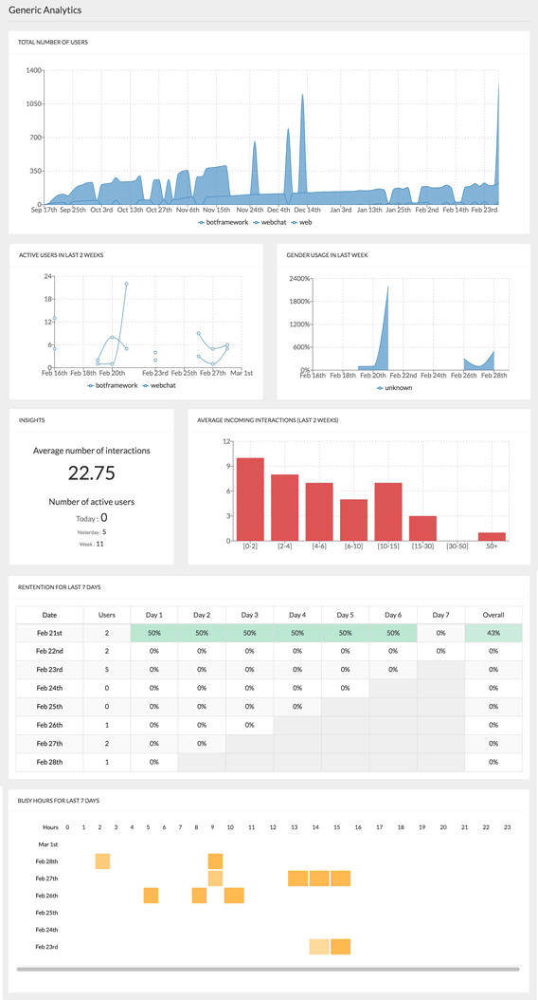

# @botpress/analytics

Analytics for Botpress provides an interface to view graphs and data of your chatbot typical usage. By using this module, you can have a look to your total users, retention, daily active users, busy hours and a lot more...



## Installation

```
npm install --save @botpress/analytics
```

## Usage

This module has some built-in analytics available from the box but also allows you to set up your own custom analytics.

For latter you need to:

1. Register graphs by calling `bp.analytics.custom.addGraph`
2. Calling `bp.analytics.custom.increment(name, count=1)` and `bp.analytics.custom.set(name, count=1)` to register events that get displayed in analytics

`bp.analytics.custom.addGraph` accepts an object with following keys:

- name (String)
- type (one of 'count', 'countUniq', 'percent', 'piechart')
- description (String)
- variables ([String]),
- fn: (Function that is used to calculate result)
- fnAvg: (Function) => that gets used for 'percent' type to calculate average value

## License

botpress-analytics is licensed under [AGPL-3.0](/LICENSE)
