# Botpress Messenger

## Install

```
npm i @botpress/channel-messenger
```

## Getting started

1. Run `npm start`. Since you don't have configuration an error will be displayed to console which is fine. Once it's displayed bot will create default configuration which you'll need to edit after stopping the bot.
2. You need to create [Facebook App](https://developers.facebook.com/)
<p>1)</p>
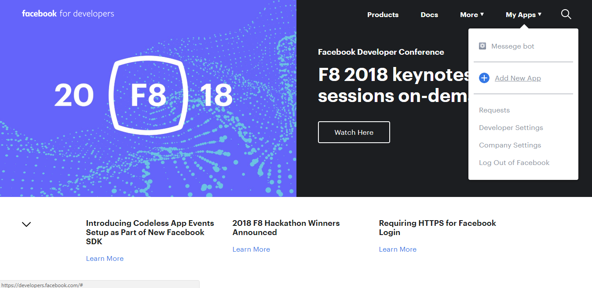
2)
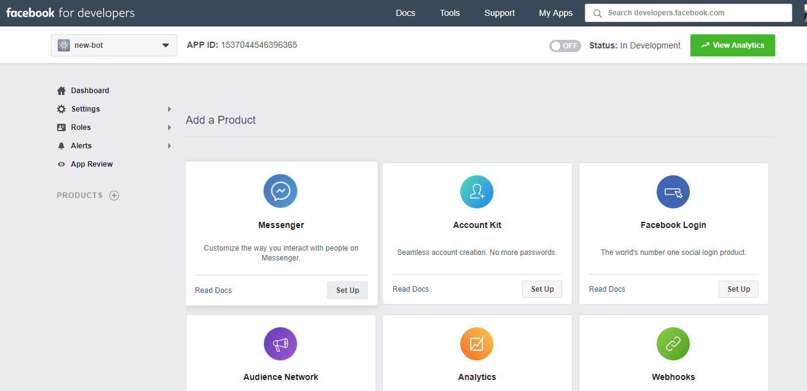
3. Get all required fields from `config/channel-messenger.json` [config template](https://github.com/botpress/botpress/blob/master/packages/channels/botpress-channel-messenger/config.json)

<p>1)</p>

2)
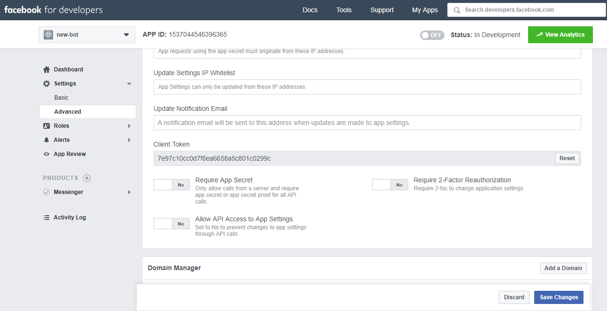
3)
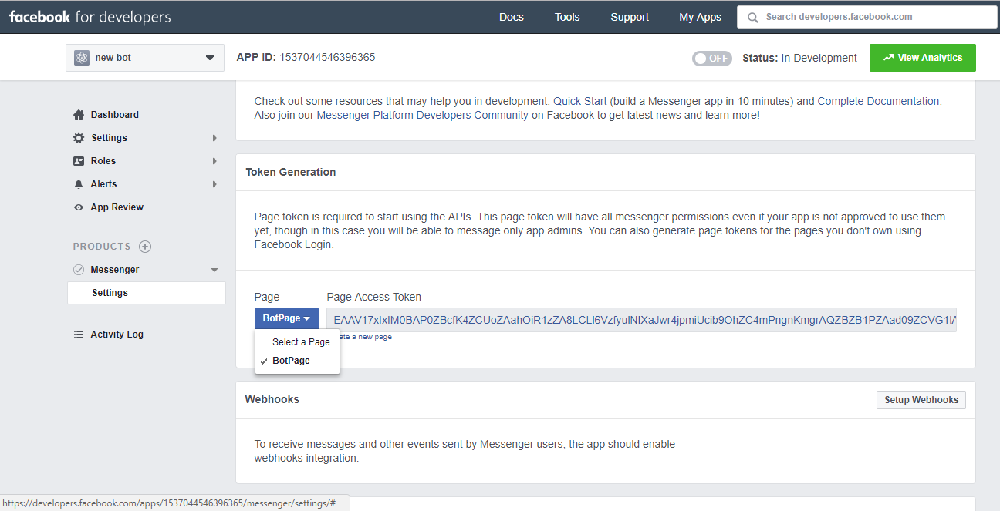
4)
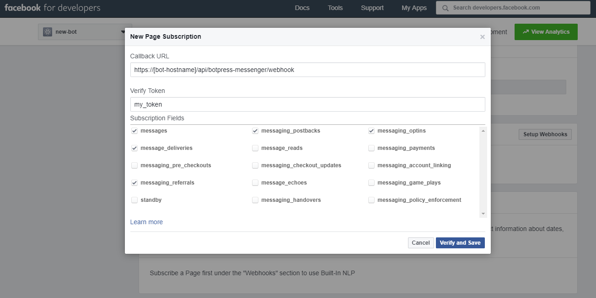
4. In you facebook-app configuration at https://developers.facebook.com/ set webhook (an url should be something like `https://[bot-hostname]/api/botpress-messenger/webhook`) and chose [next option.](https://github.com/dmytropanontko/botpress/blob/docs/messenger-tutorial/packages/channels/botpress-channel-messenger/config.json#L41). (webhook template `https://[bot-hostname]/api/botpress-messenger/webhook`)

## Explaining config keys

[Config template](https://github.com/dmytropanontko/botpress/blob/docs/messenger-tutorial/packages/channels/botpress-channel-messenger/config.json)

`"displayGetStarted"` - exclude/include interaction with Get Started. `Default: true`

`"greetingMessage"` - set default messege. `Default: "Default greeting message"`

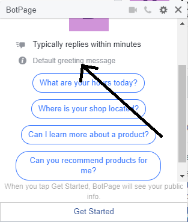

`"persistentMenu"` - added menu to your messenger. [See more](https://developers.facebook.com/docs/messenger-platform/messenger-profile/persistent-menu)

`"persistentMenuItems"` - `<needs investigation>`

`"composerInputDisabled"` - `<needs investigation>`

`"targetAudience"` - decied who will can/can't use your chat. `Default: "openToAll"`
> 1. `"openToAll"`
> 2. `"openToSome"` - chat is available for people from `"targetAudienceOpenToSome"` list
> 3. `"closeToSome"` - chat isn't available for people from `"targetAudienceCloseToSome"` list
> 4. `"closeToAll"` - chat unavailable for all

`"autoResponseOption"` - used for send automaticaly something (depend on used value) to user when he/she click on `Get Started`
It has three variant of value `"autoResponseText"|"autoResponsePostback"|"noResponse"`
> 1. `"autoResponseText"` - send text to user. Text takes from `autoResponseText`
> 2. `"autoResponsePostback"` - `<needs investigation>`
> 3. `"noResponse"` - auto response off

## Features

### Incoming

* [Profile](#profile)
* [Text messages](#text-messages)
* [Postbacks](#postbacks)
* [Attachments](#attachments)
* [Referrals](#referrals)
* [Quick replies](#quick-replies)
* [Optins](#optins)
* [Delivery](#delivery)
* [Read](#read)

### Outgoing

* [Postbacks](#postbacks-1)
* [Referrals](#referrals-1)
* [Display Get Started](#display-get-started)
* [Greeting message](#greeting-message)
* [Persistent menu](#persistent-menu)
* [Automatically mark as read](#automatically-mark-as-read)
* [Composer input disabled](#composer-input-disabled)
* [Trusted domains](#trusted-domains)
* [Automatic profile lookup](#automatic-profile-lookup)
* [Save users in DB](#save-users-in-database)
* [Webhook security check](#webhook-security-check)

## Reference

### Incoming

You can listen to incoming event easily with Botpress by using `bp` built-in `hear` function. You only need to listen to specific Messenger event to be able to react to user's actions.

```js
bp.hear({ platform: 'facebook', type: 'postback', text: 'GET_STARTED' }, (event, next) => {
      bp.renderers.sendToUser(event.user.id, '#!text-77734', { typingIndicators: false })
   }
})
```

In fact, this module preprocesses almost all types of message (message, attachment, postback, quick_reply, delivery, read, optin, referrals...) and send them to incoming middlewares. When you build a bot or a module, you can access to all information about incoming messages that have been send to  middlewares.

<!--- 
  need investigation for parameters
  https://botpress.io/docs/latest/reference/Middleware.html#.Event
  Do I need remove `user` parameter?
--->
```js
bp.middlewares.sendIncoming({
   platform: 'facebook',
   type: 'message',
   user: profile,
   text: e.message.text,
   raw: e
})
```

#### Profile

You can acces to all user's profile information by using this module. A cache have been implemented to fetch all information about users and this information is sent to middlewares.

```js
{
  id: profile.id,
  platform: 'facebook',
  gender: profile.gender,
  timezone: profile.timezone,
  locale: profile.locale,
  picture_url: profile.profile_pic,
  first_name: profile.first_name,
  last_name: profile.last_name
}
```

**Note**: All new users are automatically saved by this module in Botpress built-in database (`bp.db`).

#### Text messages

An `event` is sent to middlewares for each incoming text message from Messenger platform with all specific information.

```js
{
  platform: 'facebook',
  type: 'message',
  user: profile,
  text: e.message.text,
  raw: e
}
```

Then, you can listen easily to this `event` in your module or bot

```js
bp.hear('hello')
```

#### Postbacks

```js
{
  platform: 'facebook',
  type: 'postback',
  user: profile,
  text: e.postback.payload,
  raw: e
}
```

#### Attachments

The original attachments messenger event. May contain multiple attachments. Individual attachments are also emmited individually (see Image, Video, File below)

```js
{
  platform: 'facebook',
  type: 'attachments',
  user: profile,
  text: e.message.attachments.length + ' attachments',
  raw: e
}
```

##### Image

Individual Attachment extracted from the Attachments event.

Note that Stickers, Thumbs Up, GIFs and Pictures are considered images too.

```js
{
  platform: 'facebook',
  type: 'image', // Same for 'video', 'file' and 'audio'
  user: profile,
  text: 'http://www.image.url',
  raw: { type: 'image', payload: { url: '...' }}
}
```

##### Audio
##### Video
##### File

Same signature as `Image` above.

#### Referrals

```js
{
  platform: 'facebook',
  type: 'referral',
  user: profile,
  text: e.referral.ref,
  raw: e
}
```

#### Quick Replies

```js
{
  platform: 'facebook',
  type: 'quick_reply',
  user: profile,
  text: e.message.quick_reply.payload,
  raw: e
}
```

#### Optins

```js
{
  platform: 'facebook',
  type: 'optin',
  user: profile,
  text: e.optin.ref,
  raw: e
}
```

#### Delivery

```js
{
  platform: 'facebook',
  type: 'delivery',
  user: profile,
  text: e.delivery.watermark,
  raw: e
}
```

#### Read

```js
{
  platform: 'facebook',
  type: 'read',
  user: profile,
  text: e.read.watermark,
  raw: e
}
```

### Outgoing

By using our module, you can send anything you want to your users on Messenger. In fact, this module support all types of messages that are available on Facebook (text, images, videos, audios, webviews...).

### Send element

#### `bp.renderers.sendToUser(userId, elementOrRenderer, data)` -> Promise

1. ` userId ` (_String_): Correspond to unique Messenger's recipient identifier
2. `elementOrRenderer` (_String_): The name of the renderer to use OR an element id
3. `data` (_Object_): Additionnal data that will be passed to the renderer

```js
  bp.renderers.sendToUser(event.user.id, '#!text-77734', { typingIndicators: false })
```

#### Postbacks

This module support postbacks. Postbacks occur when a Postback button, Get Started button, Persistent menu or Structured Message is tapped ([facebook doc](https://developers.facebook.com/docs/messenger-platform/webhook-reference/postback)).

#### Referrals

This module also support referrals. In fact, the value of the `ref` parameter is passed by the server via webhook and we are able to access these referrals in parameters of input messages ([facebook doc](https://developers.facebook.com/docs/messenger-platform/webhook-reference/referral)).

#### Display Get Started

To active get started button on Messenger, users can modify display setting directly in user interface ([facebook doc](https://developers.facebook.com/docs/messenger-platform/thread-settings/get-started-button)).

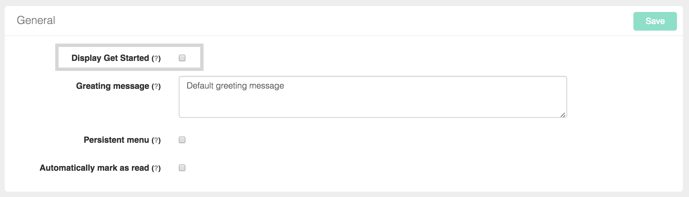


#### Greeting message

Directly in module view, users are able to modify greeting message ([facebook doc](https://developers.facebook.com/docs/messenger-platform/thread-settings/greeting-text)).


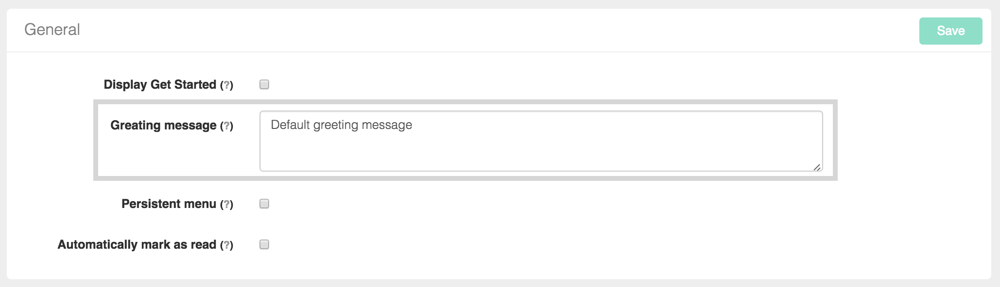

#### Persistent menu

Users can directly modify persistent menu in module user interface. By using UI, it's possible to add, modify and remove items \([facebook doc](https://developers.facebook.com/docs/messenger-platform/thread-settings/persistent-menu)\).

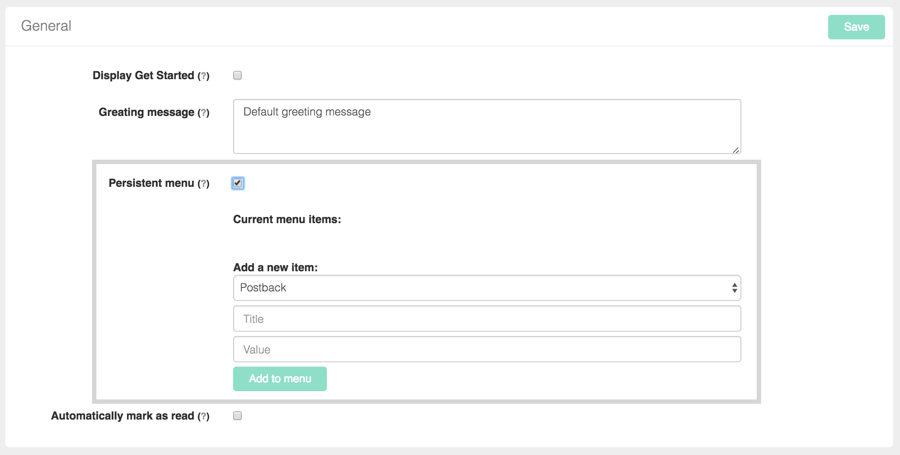

#### Automatically mark as read

Directly in UI, users can setup if they want to automatically mark all messages as read ([facebook doc](https://developers.facebook.com/docs/messenger-platform/webhook-reference/message-read)).

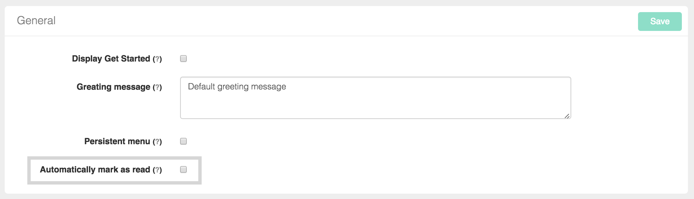

#### Composer input disabled

Directly in UI, users can setup if they want to deactivate or not the user input ([facebook doc](https://developers.facebook.com/docs/messenger-platform/thread-settings/persistent-menu)).

#### Trusted domains

By using UI, users can configure \(add, modify and remove\) trusted domains ([facebook doc](https://developers.facebook.com/docs/messenger-platform/thread-settings/domain-whitelisting)).

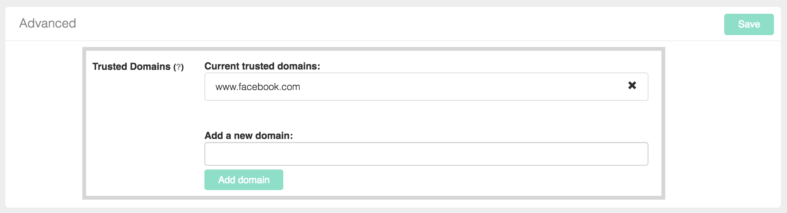

#### Chat Extensions

Using the UI, you can set the home URL for your chat extension ([facebook doc](https://developers.facebook.com/docs/messenger-platform/guides/chat-extensions)).

**Note:** the URL you specify must use HTTPS.  Facebook will return an error if you enter an URL that is not using HTTPS.

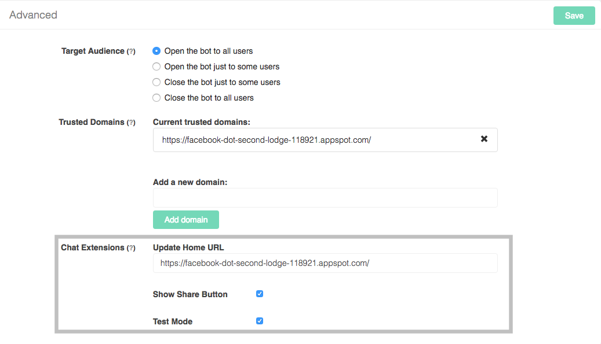

Chat extensions supports the following configuration options:
  - *Update Home URL*: the url that hosts your chat extension.  You can remove the URL by leaving the box blank.
  - *Show Share Button*: if checked, this will show a Facebook share button in the header of your webview.
  - *In Test*: if checked, your chat extension is in test mode and is only viewable by people associated with your Messenger app in the developer console.  Uncheck this box when you want your chat extension to be viewable to the general public

#### Payment Testers
Using the UI, you can assign users to be ["Payment Testers."](https://developers.facebook.com/docs/messenger-platform/thread-settings/payment#payment_test_users)

In order for this to work, the user must be a registered admin, developer or test user through your Facebook developer console and they must have initiated conversation with your bot.  You cannot just add any user to be a payment tester.  It is also important to note that this is the *only* way to run a test payment with [Messenger Extensions](https://developers.facebook.com/docs/messenger-platform/webview).

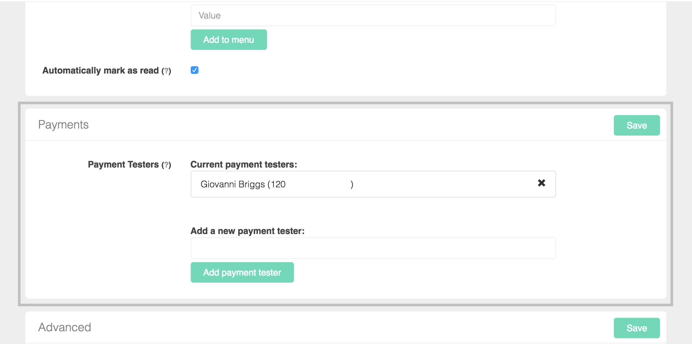

When adding a new user, you can start typing their name into the box.  This will pull up a list of matching users who have been communicating with your bot.  The value in the parentheses is the page-scoped user ID for that user.

#### Automatic profile lookup

Profiles are automatically lookedup using Facebook Graph API. The profile of the user can be found in the incoming middleware events: `event.user`

The following properties are available: first_name, last_name, locale, gender, timezone.

#### Save users in Database

Users are automatically persisted in the built-in botpress database using the built-in `bp.db.saveUser` function.

#### Webhook security check

botpress-messenger verifies that requests really come from Facebook's servers by validating requests hash.

## Example

* Botpress examples \(soon\).
* [Youtube Channel.](https://www.youtube.com/channel/UCEHfE71jUmWbe_5DtbO3fIA)

### Community

There's a [Slack community](https://slack.botpress.io) where you are welcome to join us, ask any question and even help others.

Get an invite and join us now! 👉 [https://slack.botpress.io](https://slack.botpress.io)

### License

botpress-messenger is licensed under AGPL-3.0
