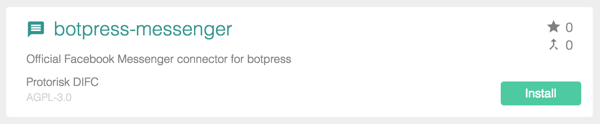
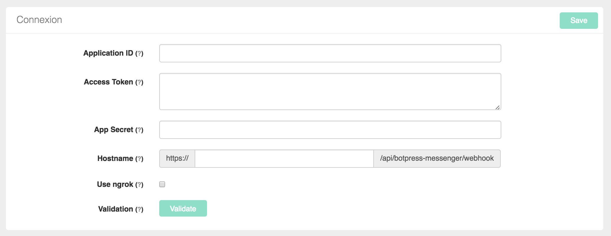
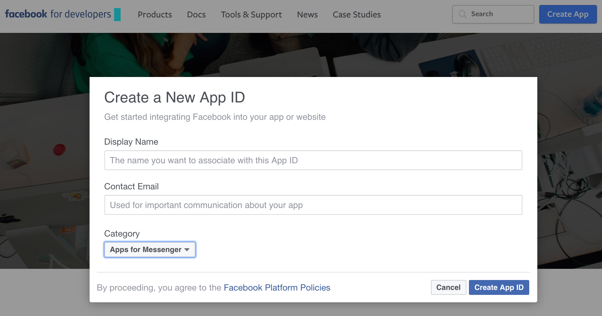
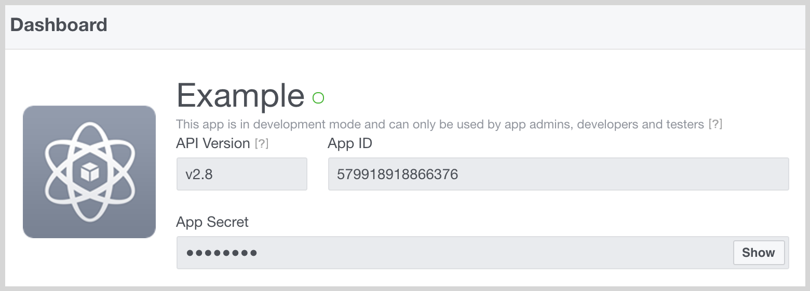
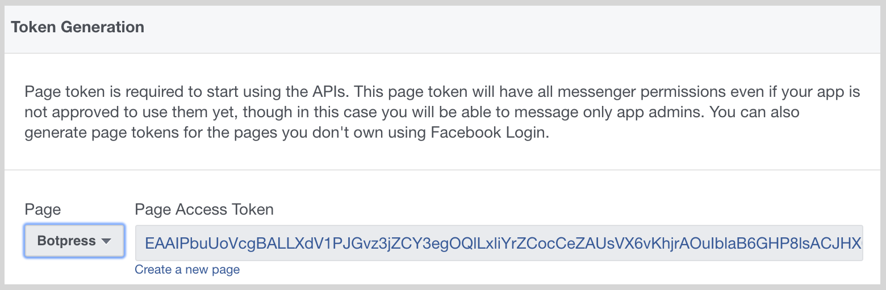

# botpress-messenger

[](https://botpress.io/docs/foundamentals/umm.html)

Official Facebook Messenger connector module for [Botpress](http://github.com/botpress/botpress).

This module has been build to accelerate and facilitate development of Messenger bots.

## Usage with UMM

There's 3 supported UMM messages: text, attachments and templates. For doing anything else, please use code (see the other methods supported in `bp.messenger` below).

> **Note on Messenger UMM**
> 
> All of the Messenger messages support the **`typing`** option. You can specify `true` a number (of milliseconds) or a natural duration string (e.g. `4s`).

#### Sending Text
##### `content.yml`

```yaml
welcome:
  - Hello, world!
  - This is a message on Messenger!
  - text: this works too!
    typing: 2s
  - |
    This is a multi-line
    message :).
```

#### Sending Text with [Quick Replies](https://developers.facebook.com/docs/messenger-platform/send-api-reference/quick-replies)

> **Tip:** We created a shortcut for specifying quick replies and their payloads.
>
>> <EXAMPLE_PAYLOAD> This is the text
>> <.EXAMPLE_PAYLOAD> Text
> In the latter, starting the payload with a dot (`.`) will prepend the name of the bloc to the postback

##### `content.yml`

```yaml
welcome:
  - text: Hello, world!
    typing: 250ms
    quick_replies:
      - <QR_YES> Yes
      - <QR_NO> No
```

##### `content.yml`

```yaml
welcome:
  - text: Hello, world!
    quick_replies:
      - <.QR_YES> Yes
      - <.QR_NO> No
```

In this example, the payloads will be `welcome.QR_YES` and `welcome.QR_NO` respectively.

##### `content.yml`

```yaml
welcome:
  - text: Hello, world!
    quick_replies:
      - content_type: text
        title: Yes
        payload: QR_YES
      - content_type: text
        title: No
        payload: QR_NO
        image_url: http://petersfantastichats.com/img/green.png
      - content_type: location
```

#### Sending [Templates](https://developers.facebook.com/docs/messenger-platform/send-api-reference/templates)

> **Tip:** We created a shortcut for specifying buttons and their payload (same as quick replies)
>
>> <EXAMPLE_PAYLOAD> This is the text

##### `content.yml`

```yaml
welcome:
  - on: facebook
    template_type: button
    text: Please click any of the buttons below
    buttons:
      - <BTN_RANDOM> Random cat videos
      - type: postback
        title: This button gives the same thing
        payload: BTN_RANDOM
      - type: web_url
        url: https://youtube.com/?q=cats
        title: Cats on Youtube
```

#### Sending [Attachments](https://developers.facebook.com/docs/messenger-platform/send-api-reference/attachment-upload)

> **Tip:** We created shortcuts for all the attachment types (see examples)

##### `content.yml`

```yaml
welcome:
  - on: facebook
    image: https://botpress.io/static/img/nobg_primary_black.png
  - on: facebook
    video: https://www.youtube.com/watch?v=QIokUU4HAKU
  - on: facebook
    attachment: video
    url: https://www.youtube.com/watch?v=QIokUU4HAKU
```

## Installation

Installing modules on Botpress is simple. By using the CLI, you only need to type this command in your terminal to add the messenger module to your bot.

```
botpress install messenger
```

It's also possible to install it through the Botpress UI in the modules section.



## Get started

To setup connexion of your chatbot to Messenger, you need to fill the connexion settings directly in the module interface. In fact, you only need to follow these 5 steps and your bot will be active.



We **highly recommand** to set your configuration in the `botpress-messenger.config.yml` file that has been automatically created for you, so you won't have any problem to migrate and commit your configuration settings. Settings in this file can (and should) be overwritten by environment variables in production.

> **Tip:** You can also set all the other configs using this configuration file, simply add them and it will override the configuration set in the database.

##### 1. Create a [**Facebook page**](https://www.facebook.com/pages/create) and a [**Messenger application**](https://developers.facebook.com).



##### 2. Get App ID and App Secret
These information are available on dashboard of developers page. You only need to copy them in module interface.



##### 3. Get Access token
Acces token is available in Messenger section of developers. You need to copy it in the appropriate section of botpress-messenger UI.



##### 4. Setup Hostname

You need to manually set your **hostname**, here are some you secure tunnels to localhost tools, we suggest you to use for local development:

  - **[pagekite](https://pagekite.net/)** *(highly recommanded, to get a fix url)*
  - **[localtunnel](https://github.com/localtunnel/localtunnel)** *(recommanded)*
  - **[ngrok](https://ngrok.com)** *(recommanded)*

In production, the hostname is your public server hostname (for example your heroku address).

##### 5. Connect

> **Tip:** To see in details how to configure completly this module, videos are available on our [Youtube Channel](https://www.youtube.com/c/botpress)

## Features

### Incoming

* [Profile](#profile)
* [Text messages](#text-messages)
* [Postbacks](#postbacks)
* [Attachments](#attachments)
* [Referrals](#referrals)
* [Quick replies](#quick-replies)
* [Optins](#optins)
* [Delivery](#delivery)
* [Read](#read)

### Outgoing

* [Text messages](#text-messages-1)
* [Attachments](#attachments-1)
* [Templates](#templates)
* [Quick replies](#quick-replies-1)
* [Automatic typing indicator](#automatic-typing-indicator)
* [Postbacks](#postbacks-1)
* [Referrals](#referrals-1)
* [Display Get Started](#display-get-started)
* [Greeting message](#greeting-message)
* [Persistent menu](#persistent-menu)
* [Automatically mark as read](#automatically-mark-as-read)
* [Composer input disabled](#composer-input-disabled)
* [Trusted domains](#trusted-domains)
* [Automatic profile lookup](#automatic-profile-lookup)
* [Save users in DB](#save-users-in-database)
* [Webhook security check](#webhook-security-check)

## Reference

### Incoming

You can listen to incoming event easily with Botpress by using `bp` built-in `hear` function. You only need to listen to specific Messenger event to be able to react to user's actions.

```js
bp.hear({ platform: 'facebook', type: 'postback', text: 'GET_STARTED' }, (event, next) => {
      bp.messenger.sendText(event.user.id, 'Welcome on Botpress!!!')
   }
})
```

In fact, this module preprocesses almost all types of message (message, attachment, postback, quick_reply, delivery, read, optin, referrals...) and send them to incoming middlewares. When you build a bot or a module, you can access to all information about incoming messages that have been send to  middlewares.

```js
bp.middlewares.sendIncoming({
   platform: 'facebook',
   type: 'message',
   user: profile,
   text: e.message.text,
   raw: e
})
```

#### Profile

You can acces to all user's profile information by using this module. A cache have been implemented to fetch all information about users and this information is sent to middlewares.

```js
{
  id: profile.id,
  platform: 'facebook',
  gender: profile.gender,
  timezone: profile.timezone,
  locale: profile.locale
}
```

**Note**: All new users are automatically saved by this module in Botpress built-in database (`bp.db`).

#### Text messages

An `event` is sent to middlewares for each incoming text message from Messenger platform with all specific information.

```js
{
  platform: 'facebook',
  type: 'message',
  user: profile,
  text: e.message.text,
  raw: e
}
```

Then, you can listen easily to this `event` in your module or bot

```js
bp.hear('hello')
```

#### Postbacks

```js
{
  platform: 'facebook',
  type: 'postback',
  user: profile,
  text: e.postback.payload,
  raw: e
}
```

#### Attachments

The original attachments messenger event. May contain multiple attachments. Individual attachments are also emmited individually (see Image, Video, File below)

```js
{
  platform: 'facebook',
  type: 'attachments',
  user: profile,
  text: e.message.attachments.length,
  raw: e
}
```

##### Image

Individual Attachment extracted from the Attachments event.

Note that Stickers, Thumbs Up, GIFs and Pictures are considered images too.

```js
{
  platform: 'facebook',
  type: 'image', // Same for 'video', 'file' and 'audio'
  user: profile,
  text: 'http://www.image.url',
  raw: { type: 'image', payload: { url: '...' }}
}
```

##### Audio
##### Video
##### File

Same signature as `Image` above.

#### Referrals

```js
{
  platform: 'facebook',
  type: 'referral',
  user: profile,
  text: e.referral.ref,
  raw: e
}
```

#### Quick Replies

```js
{
  platform: 'facebook',
  type: 'quick_reply',
  user: profile,
  text: e.message.quick_reply.payload,
  raw: e
}
```

#### Optins

```js
{
  platform: 'facebook',
  type: 'optin',
  user: profile,
  text: e.optin.ref,
  raw: e
}
```

#### Delivery

```js
{
  platform: 'facebook',
  type: 'delivery',
  user: profile,
  text: e.delivery.watermark,
  raw: e
}
```

#### Read

```js
{
  platform: 'facebook',
  type: 'read',
  user: profile,
  text: e.read.watermark,
  raw: e
}
```

### Outgoing

By using our module, you can send anything you want to your users on Messenger. In fact, this module support all types of messages that are available on Facebook (text, images, videos, audios, webviews...).

#### Creating actions without sending them

Note that all the below actions are available under two format: `send___` and `create____`, the latter effectively only creating the middleware Event without sending it to the outgoing middleware. This is useful when combining libraries together (for example Botkit):

```js
  // This message won't be sent
  const message = bp.messenger.createText(event.user.id, 'What is your name?')
  // But `message` is a fully formed middleware event object, ready to be sent
  // example using the botpress-botkit module
  convo.ask(message, function(response, convo) { /* ... */ })
```

### Text messages

In code, it is simple to send a message text to a specific users ([facebook doc](https://developers.facebook.com/docs/messenger-platform/send-api-reference/text-message)).

#### `sendText(userId, text, [options])` -> Promise

##### Arguments

1. ` userId ` (_String_): Correspond to unique Messenger's recipient identifier. Usually, this `recipient_id` is available from input message.

2. ` text ` (_String_): Text message that will be send to user.

3. ` options ` (_Object_): An object that may contain:
- `quick_replies` which is an array of quick replies to attach to the message
- `typing` indicator. true for automatic timing calculation or a number in milliseconds (turns off automatically)
- `waitDelivery` the returning Promise will resolve only when the message is delivered to the user
- `waitRead` the returning Promise will resolve only when the user reads the message

##### Returns

(_Promise_): Send to outgoing middlewares a formatted `Object` than contains all information (platform, type, text, raw) about the text message that needs to be sent to Messenger platform. The promise resolves when the message was successfully sent to facebook, except if you set the `waitDelivery` or `waitRead` options.

##### Example

```js
const userId = 'USER_ID'
const text = "Select between these two options?"
const options = {
  quick_replies: [
    {
      content_type: "text",
      title: "Option 1",
      payload: "DEVELOPER_DEFINED_PAYLOAD_FOR_OPTION_1"
    },
    {
      content_type:"text",
      title:"Option 2",
      payload: "DEVELOPER_DEFINED_PAYLOAD_FOR_OPTION_2"
    }
  ],
  typing: true,
  waitRead: true
}

bp.messenger.sendText(userId, text, options)
.then(() => {
  // the message was read because of `waitRead` option
})
```

### Attachments

By using this function, you can send any type of attachment to your users ([facebook doc](https://developers.facebook.com/docs/messenger-platform/send-api-reference/contenttypes)).

#### `sendAttachment(userId, type, url, [options])` -> Promise

##### Arguments

1. ` userId ` (_String_): Correspond to unique Messenger's recipient identifier

2. ` type ` (_String_): Specific type of  attachment can be `'audio'`, `'file'`, `'image'` or `'video'`

3. ` url ` (_String_): Correspond to specific url of the attachment that need to be sent.

4. ` options ` (_Object_): An object that may contain:
- `quick_replies`
- `typing`
- `waitDelivery` the returning Promise will resolve only when the message is delivered to the user
- `waitRead` the returning Promise will resolve only when the user reads the message

##### Returns

(_Promise_): Send to outgoing middlewares a formatted `Object` than contains all information (platform, type, text, raw) about the attachment that needs to be sent to Messenger platform.

##### Example

```js
const userId = 'USER_ID'
const type = 'image'
const url = 'https://botpress.io/static/img/nobg_primary_black.png'

bp.messenger.sendAttachment(userId, type, url)
```

### Templates

By using this module, it's easy to send any type of supported template to your users ([facebook doc](https://developers.facebook.com/docs/messenger-platform/send-api-reference/templates)).

#### `sendTemplate(userId, payload, [options])` -> Promise

##### Arguments

1. ` userId ` (_String_): Correspond to unique Messenger's recipient identifier

2. ` payload ` (_Object_): Specific `payload` object for your selected template. Actually, many types of template (button, generic, list, receipt...) are supported by Messenger.

3. ` options ` (_Object_): An object that may contains:
- `typing`
- `waitDelivery` the returning Promise will resolve only when the message is delivered to the user
- `waitRead` the returning Promise will resolve only when the user reads the message

##### Returns

(_Promise_): Send to outgoing middlewares a formatted `Object` than contains all information (platform, type, text, raw) about the template that needs to be sent.

##### Example

```js
const userId = 'USER_ID'
const payload = {
    template_type: "button",
    text: "Have you seen our awesome website?",
    buttons: [
        {
            type: "web_url",
            url: "https://www.botpress.io",
            title: "Show Website"
        }
    ]
}

bp.messenger.sendTemplate(userId, payload, { typing: 2000 })
```

#### Quick replies
By using `options` argument, you can easily add quick replies to text messages or attachments.

```js
const options = {
    quick_replies: [
        {
            content_type :"text",
            title: "Option",
            payload: "DEVELOPER_DEFINED_PAYLOAD_FOR_OPTION"
        }
    ]
}
```

#### Automatic typing indicator

As quick replies, you can add an automatic typing indicator to your messages by adding `typing` to `options` argument.

```js
const options = { typing: true }
```


#### Postbacks

This module support postbacks. Postbacks occur when a Postback button, Get Started button, Persistent menu or Structured Message is tapped ([facebook doc](https://developers.facebook.com/docs/messenger-platform/webhook-reference/postback)).

#### Referrals

This module also support referrals. In fact, the value of the `ref` parameter is passed by the server via webhook and we are able to access these referrals in parameters of input messages ([facebook doc](https://developers.facebook.com/docs/messenger-platform/webhook-reference/referral)).

#### Display Get Started

To active get started button on Messenger, users can modify display setting directly in user interface ([facebook doc](https://developers.facebook.com/docs/messenger-platform/thread-settings/get-started-button)).


#### Greeting message

Directly in module view, users are able to modify greeting message ([facebook doc](https://developers.facebook.com/docs/messenger-platform/thread-settings/greeting-text)).


#### Persistent menu

Users can directly modify persistent menu in module user interface. By using UI, it's possible to add, modify and remove items \([facebook doc](https://developers.facebook.com/docs/messenger-platform/thread-settings/persistent-menu)\).


#### Automatically mark as read

Directly in UI, users can setup if they want to automatically mark all messages as read ([facebook doc](https://developers.facebook.com/docs/messenger-platform/webhook-reference/message-read)).


#### Composer input disabled

Directly in UI, users can setup if they want to deactivate or not the user input ([facebook doc](https://developers.facebook.com/docs/messenger-platform/thread-settings/persistent-menu)).

#### Trusted domains

By using UI, users can configure \(add, modify and remove\) trusted domains ([facebook doc](https://developers.facebook.com/docs/messenger-platform/thread-settings/domain-whitelisting)).


#### Chat Extensions

Using the UI, you can set the home URL for your chat extension ([facebook doc](https://developers.facebook.com/docs/messenger-platform/guides/chat-extensions)).

**Note:** the URL you specify must use HTTPS.  Facebook will return an error if you enter an URL that is not using HTTPS.


Chat extensions supports the following configuration options:
  - *Update Home URL*: the url that hosts your chat extension.  You can remove the URL by leaving the box blank.
  - *Show Share Button*: if checked, this will show a Facebook share button in the header of your webview.
  - *In Test*: if checked, your chat extension is in test mode and is only viewable by people associated with your Messenger app in the developer console.  Uncheck this box when you want your chat extension to be viewable to the general public

#### Payment Testers
Using the UI, you can assign users to be ["Payment Testers."](https://developers.facebook.com/docs/messenger-platform/thread-settings/payment#payment_test_users)

In order for this to work, the user must be a registered admin, developer or test user through your Facebook developer console and they must have initiated conversation with your bot.  You cannot just add any user to be a payment tester.  It is also important to note that this is the *only* way to run a test payment with [Messenger Extensions](https://developers.facebook.com/docs/messenger-platform/webview).


When adding a new user, you can start typing their name into the box.  This will pull up a list of matching users who have been communicating with your bot.  The value in the parentheses is the page-scoped user ID for that user.

#### Automatic profile lookup

Profiles are automatically lookedup using Facebook Graph API. The profile of the user can be found in the incoming middleware events: `event.user`

The following properties are available: first_name, last_name, locale, gender, timezone.

#### Save users in Database

Users are automatically persisted in the built-in botpress database using the built-in `bp.db.saveUser` function.

#### Webhook security check

botpress-messenger verifies that requests really come from Facebook's servers by validating requests hash.

## Example

* Botpress examples \(soon\).
* Youtube Channel \(soon\).

### Community

There's a [Slack community](https://slack.botpress.io) where you are welcome to join us, ask any question and even help others.

Get an invite and join us now! 👉 [https://slack.botpress.io](https://slack.botpress.io)

### License

botpress-messenger is licensed under AGPL-3.0
