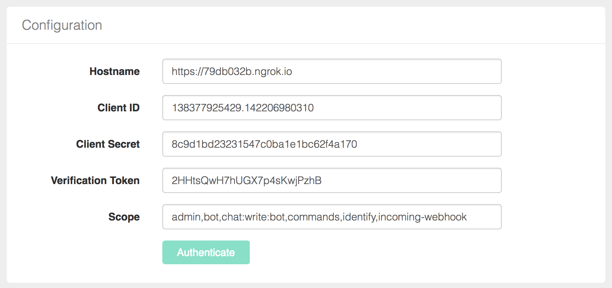
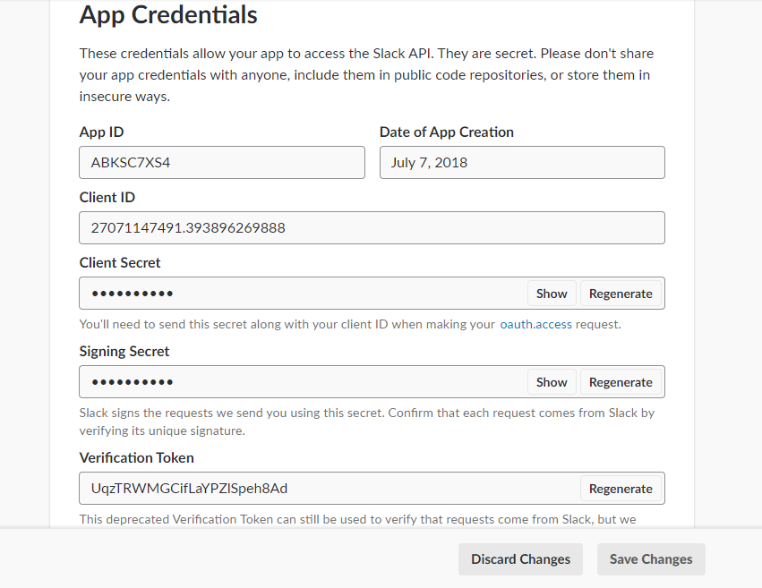
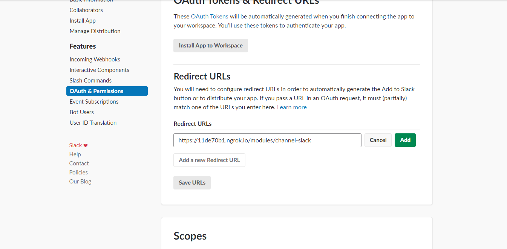
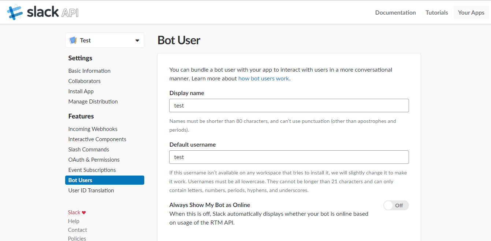
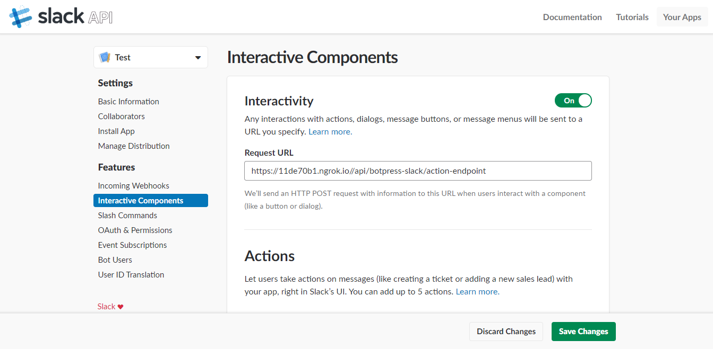
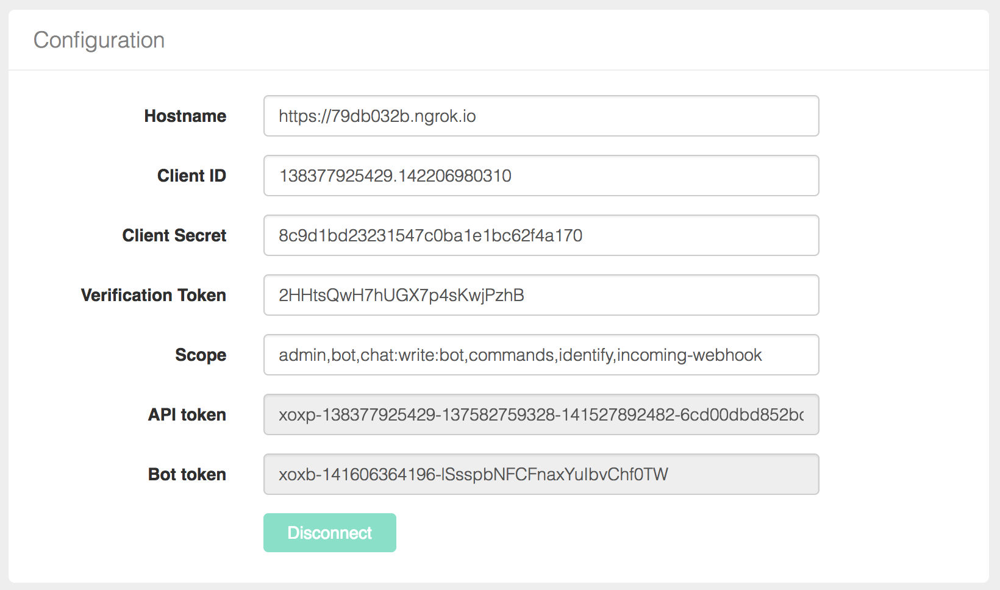

# @botpress/channel-slack

Official Slack connector module for [Botpress](http://github.com/botpress/botpress).

This module has been built to accelerate and facilitate development of Slack bots.

## Installation

Installing modules on Botpress is simple.

```js
npm i --save @botpress/channel-slack
```

## Get started

To setup connexion of your chatbot to Slack, you need to fill the connexion settings directly in the module interface. In fact, you only need to follow these steps and your bot will be ready to use.

Settings can also be set programmatically by providing the settings in the `config/channel-slack.json`



#### 1. Setup Hostname

You need to manually enter your hostname. If you are developping locally, we suggest using [ngrok](https://ngrok.com/) to deploy your chatbot ([learn more about ngrok](https://ngrok.com)

#### 2. Create a [**Slack app**](https://api.slack.com/apps?new_app=1)
  


#### 3. Get Client ID, Client Secret and Verification Token

These information are available on **Basic Information** of you app. You only need to copy them in module interface.



#### 4. Setup OAuth & Permissions

On the **OAuth & Permissions** page of your slack app, you need to enter your redirect url for the authentification. The redirect url need to be `${hostname}/modules/channel-slack` as you can see in the example screenshot below.



#### 5. Create a Bot User

On the **Bot Users** page of your slack app, you need to add a Bot User by clicking on **Add a Bot User**. We suggest you to turn on **Always Show My Bot as Online** for be able to use RTM API correctly.



#### 6. Setup Interactive Components

On the **Interactive Components** page of your slack app, you need to **Enable Interactive Components** and add a **Request URL**. The URL entered needs to be format as `${hostname}/api/botpress-slack/action-endpoint`.



#### 7. Set scope

On your configuration page of your module, you need to set scope of your bot. We suggest you to keep the default configuration (**admin,bot,chat:write:bot,commands,identify,incoming-webhook,channels:read**), but if you want to want to modify it, we suggest you to look to the [documentation](https://api.slack.com/docs/oauth-scopes).

#### 8. Authenticate & Connect

Next step is to authenticate and connect your bot. To do it, you only need to click on **Authenticate & Connect** on your module and follow the steps. Once it will be done, you should received an **API Token** and a **Bot Token**. They will appear on your settings page of your module.



If you want to have more information about documentation, options and API, we suggest you to look at the [official slack documentation](https://api.slack.com/).

## Features

### Incoming

* [Profile](#profile)
* [Text](#text)
* [Reaction](#reaction)
* [Typing](#typing)
* [File](#file)
* [User mention](#user-mention)
* [Bot mention](#bot-mention)
* [Others](#others)
* [Direct message](#direct-message)
* [Validation](#validation)

### Outgoing

* [Text](#text)
* [Attachments](#attachments)
* [Reaction](#reaction)
* [Update text](#update-text)
* [Update attachments](#update-attachments)
* [Delete text or attachments](#delete-text-or-attachments)
* [Remove reaction](#remove-reaction)

### API

* Status
* User
* Users
* Channels
* Team
* Data

## Reference

### Incoming

You can listen to incoming event easily with Botpress by using `bp` built-in `hear` function. You only need to listen to specific Slack event to be able to react to user's actions.

```js
bp.hear({ platform: 'slack', type: 'message', text: 'Hello' }, (event, next) => {
	bp.slack.sendText(event.channel.id, 'Welcome on Botpress!!!')
})
```

In fact, this module preprocesses almost all types of message (message, reaction, attachments, file, typing...) and send them to incoming middlewares. When you build a bot or a module, you can access to all information about incoming messages that have been send to  middlewares.

```js
bp.middlewares.sendIncoming({
	platform: 'slack',
	type: 'message',
	text: 'Text message here... (e.g. Hello world)'
	user: [Object],
	channel: { id: 'D45FHSDEW' },
	ts: '1487273756.000116',
	direct: true,
	raw: [Object]
})
```

#### Profile

You can acces to all user's profile information (`event.user`) by using this module. A cache have been implemented to fetch all information about users and this information is sent to middlewares.

```js
{
  "id": "U023BECGF",
  "team_id": "T021F9ZE2",
  "name": "bobby",
  "deleted": false,
  "status": null,
  "color": "9f69e7",
  "real_name": "Bobby Tables",
  "tz": "America\/Los_Angeles",
  "tz_label": "Pacific Daylight Time",
  "tz_offset": -25200,
  "profile": {
      "avatar_hash": "ge3b51ca72de",
      "first_name": "Bobby",
      "last_name": "Tables",
      "real_name": "Bobby Tables",
      "email": "bobby@slack.com",
      "skype": "my-skype-name",
      "phone": "+1 (123) 456 7890",
      "image_24": "https:\/\/...",
      "image_32": "https:\/\/...",
      "image_48": "https:\/\/...",
      "image_72": "https:\/\/...",
      "image_192": "https:\/\/..."
  },
  "is_admin": true,
  "is_owner": true,
  "has_2fa": false
}
```

**Note**: All new users are automatically saved by this module in Botpress built-in database (`bp.db`).

#### Text

An `event` is sent to middlewares for each incoming text message from Slack platform with all specific information.

```js
{
  platform: 'slack',
	type: 'message',
	text: 'Text message here... (e.g. Hello world)',
	user: [Object],
	channel: { id: 'D45FHSDEW' },
	ts: '1487273756.000116',
	direct: true,
	raw: [Object]
}
```

Then, you can listen easily to this `event` in your module or bot

```js
bp.hear('hello')
```

#### Reaction

```js
{
  platform: 'slack',
	type: 'reaction',
	text: 'Dany Fortin-Simard reacted using wink',
	user: [Object],
	reaction: 'wink',
	channel: { id: 'D45FHSDEW' },
	ts: '1487273756.000116',
	direct: true,
	raw: [Object]
}
```

#### Typing

```js
{
  platform: 'slack',
	type: 'typing',
	text: 'Sylvain Perron is typing',
	user: [Object],
	channel: { id: 'D45FHSDEW' },
	ts: '1487273756.000116',
	direct: true,
	raw: [Object]
}
```

#### File

```js
{
  platform: 'slack',
	type: 'file',
	text: 'Justin Watson shared a file',
	user: [Object],
	file: [Object],
	channel: { id: 'D45FHSDEW' },
	ts: '1487273756.000116',
	direct: true,
	raw: [Object]
}
```

#### User mentioned

User mentioned is sent each time a user mentions another user in a message.

```js
{
  platform: 'slack',
	type: 'user_mentioned',
	text: 'User has been mentioned',
	user: [Object],
	mentionedId: 'U41H4NB9N',
	channel: { id: 'D45FHSDEW' },
	ts: '1487273756.000116',
	direct: true,
	raw: [Object]
}
```

#### Bot mentioned

Bot mentioned is sent to incoming middlewares when your bot is mentioned in a message.

```js
{
  platform: 'slack',
	type: 'bot_mentioned',
	text: 'Bot has been mentioned',
	user: [Object],
	mentionedId: 'U41H4NB9N',
	channel: { id: 'D45FHSDEW' },
	ts: '1487273756.000116',
	direct: true,
	raw: [Object]
}
```

#### Other

Slack connector also receives all other events that come from Real Time Messaging API. You can look at the [documentation](https://api.slack.com/rtm) to have more information about some specific event. 

```js
{
  platform: 'slack',
	type: 'other_types',
	text: 'An another type of event occured',
	raw: [Object]
}
```

#### Direct message

As you can see in all incoming events, we added a particular field `direct` to differentiate message that comes from channel or direct.

```
{
	direct: false
}
```

#### Validation

This module also comes with some validation to be certain that events are coming from Slack API. For that, each incoming event are validated using your verification token.

### Outgoing

By using our module, you can send anything you want to your users on Slack. In fact, this module support most important types of messenge that are available on Slack (text, attachments, button, reaction).

#### Creating actions without sending them

Note that all the below actions are available under two format: `send___` and `create____`, the latter effectively only creating the middleware Event without piping (sending) it to the outgoing middleware. This is useful when combining libraries together (for example Botkit):

```js
  // This message won't be sent
  const message = bp.slack.createText(event.channel.id, 'What is your name?')
  // But `message` is a fully formed middleware event object, ready to be sent
  // example using the botpress-botkit module
  convo.ask(message, function(response, convo) { /* ... */ })
```

### Text

In code, it is simple to send a message text to a specific channel ([slack doc](https://api.slack.com/methods/chat.postMessage)).

#### `sendText(channel, text, [options])` -> Promise

##### Arguments

1. ` channelId ` (_String_): Correspond to unique Channel's recipient identifier. Usually, this `channelId` is available from input message.

2. ` text ` (_String_): Text message that will be send to channel.

3. ` options ` (_Object_): An object that may contain possible options for normal `chat.postMessage` (see [documentation](https://api.slack.com/methods/chat.postMessage) for more details)

##### Returns

(_Promise_): Send to outgoing middlewares a formatted `Object` than contains all information (platform, type, text, raw) about the text message that needs to be sent to Slack platform. The promise resolves when the message was successfully sent to slack.

##### Example

```js
bp.hear({ platform: 'slack', text: 'Hello'}, event => {
	const channelId = event.channel.id
	const text = 'Hello human!'

	bp.slack.sendText(channelId, text)
	.then(() => {
		//Do something else
	})
})

```

### [Attachments](https://api.slack.com/docs/message-attachments)

By using this function, you can send any type of attachment to your users ([slack doc](https://api.slack.com/docs/message-formatting). Also, you should look to the [message builder](https://api.slack.com/docs/messages/builder) to have a better idea of all possible attachments you can send.

#### `sendAttachments(channelId, attachments, [options])` -> Promise

##### Arguments

1. ` channelId ` (_String_): Correspond to unique Channel's recipient identifier. Usually, this `channelId` is available from input message.

2. ` attachments ` (_Array_): An array of attachments to be sent.

3. ` options ` (_Object_): An object that may contain possible options for normal `chat.postMessage` (see [documentation](https://api.slack.com/methods/chat.postMessage) for more details)

##### Returns

(_Promise_): Send to outgoing middlewares a formatted `Object` than contains all information (platform, type, text, raw) about the attachment that needs to be sent to Slack platform.

##### Example

```js
bp.slack.sendAttachments(event.channel.id, [
  {
    "title": "The Further Adventures of Slackbot",
    "fields": [
      {
        "title": "Volume",
        "value": "1",
        "short": true
      },
      {
        "title": "Issue",
        "value": "3",
				"short": true
      }
    ],
    "author_name": "Stanford S. Strickland",
    "author_icon": "http://a.slack-edge.com/7f18https://a.slack-edge.com/bfaba/img/api/homepage_custom_integrations-2x.png",
    "image_url": "http://i.imgur.com/OJkaVOI.jpg?1"
  },
  {
    "title": "Synopsis",
    "text": "After @episod pushed exciting changes to a devious new branch back in Issue 1, Slackbot notifies @don about an unexpected deploy..."
  },
  {
    "fallback": "Would you recommend it to customers?",
    "title": "Would you recommend it to customers?",
    "callback_id": "comic_1234_xyz",
    "color": "#3AA3E3",
    "attachment_type": "default",
    "actions": [
      {
        "name": "recommend",
        "text": "Recommend",
        "type": "button",
        "value": "recommend"
      },
      {
        "name": "no",
        "text": "No",
        "type": "button",
        "value": "bad"
      }
    ]
  }
])
```

### Reaction

By using this module, it's easy to send any type of reaction on previous message ([slack doc](https://api.slack.com/methods/reactions.add)).

#### `bp.slack.sendReaction(name, options)` -> Promise

##### Arguments

1. ` name ` (_String_): Correspond to the name of the reaction
2. ` options ` (_Object_): An object that may contains:
- `channel`: Correspond to unique Channel's where you want to react. Usually, this `channel` is available from previous message. (**required** to reaction to text or attachments)
- `timestamp`: Correspond to unique timestamp of the message. Usually, this `ts` is available from previous message. (**required** to reaction to text or attachments)
- `file` Correspond to the file to add reaction to.
- `file_comment` File comment to add reaction to.

##### Returns

(_Promise_): Send to outgoing middlewares a formatted `Object` than contains all information (platform, type, text, raw) about the reaction that needs to be sent.

##### Example

```js
bp.hear({ platform: 'slack', text:'I love you'}, event => {
	bp.slack.sendReaction('kissing_smiling_eyes', { channel: event.channel.id, timestamp: event.ts })
}) 
```

### Update text

In code, it is simple to update a message text on a specific channel ([slack doc](https://api.slack.com/methods/chat.update)).

#### `sendUpdateText(ts, channel, text, [options])` -> Promise

##### Arguments
1. ` ts ` (_String_): Correspond to unique timestamp of the message. Usually, this `ts` is available from previous message.

2. ` channelId ` (_String_): Correspond to unique Channel's recipient identifier. Usually, this `channelId` is available from input message.

3. ` text ` (_String_): Text message that will be send to channel.

4. ` options ` (_Object_): An object that may contain possible options for normal `chat.update` (see [documentation](https://api.slack.com/methods/chat.update) for more details)

##### Returns

(_Promise_): Send to outgoing middlewares a formatted `Object` than contains all information (platform, type, text, raw) about the text message that needs to be sent to Slack platform. The promise resolves when the message was successfully sent to slack.


### Update attachments

By using this function, you can update any type of attachment on a specific channel ([slack doc](https://api.slack.com/methods/chat.update).

#### `sendUpdateAttachments(ts, channelId, attachments, [options])` -> Promise

##### Arguments
1. ` ts ` (_String_): Correspond to unique timestamp of the message. Usually, this `ts` is available from previous message.

2. ` channelId ` (_String_): Correspond to unique Channel's recipient identifier. Usually, this `channelId` is available from input message.

3. ` attachments ` (_Array_): An array of attachments to be sent.

4. ` options ` (_Object_): An object that may contain possible options for normal `chat.update` (see [documentation](https://api.slack.com/methods/chat.update) for more details)

##### Returns

(_Promise_): Send to outgoing middlewares a formatted `Object` than contains all information (platform, type, text, raw) about the attachment that needs to be sent to Slack platform.


### Delete text or attachments

By using this function, you can delete any type of text or attachments on a channel ([slack doc](https://api.slack.com/methods/chat.delete).

#### `sendDeleteTextOrAttachments(ts, channelId, [options])` -> Promise

##### Arguments
1. ` ts ` (_String_): Correspond to unique timestamp of the message. Usually, this `ts` is available from previous message.

2. ` channelId ` (_String_): Correspond to unique Channel's recipient identifier. Usually, this `channelId` is available from input message.

3. ` options ` (_Object_): An object that may contain possible options for normal `chat.delete` (see [documentation](https://api.slack.com/methods/chat.postMessage) for more details)

##### Returns

(_Promise_): Send to outgoing middlewares a formatted `Object` than contains all information (platform, type, text, raw) about the attachment that needs to be sent to Slack platform.

### Remove reaction

By using this module, it's easy to remove any type of reaction on previous message ([slack doc](https://api.slack.com/methods/reactions.remove)).

#### `bp.slack.sendRemoveReaction(name, options)` -> Promise

##### Arguments

1. ` name ` (_String_): Correspond to the name of reaction
2. ` options ` (_Object_): An object that may contains:
- `channel`: Correspond to unique Channel's where you want to react. Usually, this `channel` is available from previous message. (**required** to reaction to text or attachments)
- `timestamp`: Correspond to unique timestamp of the message. Usually, this `ts` is available from previous message. (**required** to reaction to text or attachments)
- `file` Correspond to the file to add reaction to.
- `file_comment` File comment to add reaction to.

##### Returns

(_Promise_): Send to outgoing middlewares a formatted `Object` than contains all information (platform, type, text, raw) about the reaction that needs to be sent.
 
#### Save users in Database

Users are automatically persisted in the built-in botpress database using the built-in `bp.db.saveUser` function.

### API

##### `GET /api/botpress-slack/status`

Returns status of the connexion.

##### `GET /api/botpress-slack/user?id=<USER_ID>`

Returns information about a specific user.

##### `GET /api/botpress-slack/users`

Returns the list of all the users.

##### `GET /api/botpress-slack/channels`

Returns the list of the channels.

##### `GET /api/botpress-slack/team`

Return team information.

##### `GET /api/botpress-slack/data`

Returns all information about the bot, users, channels, teams...


### Community

There's a [Slack community](https://slack.botpress.io) where you are welcome to join us, ask any question and even help others.

Get an invite and join us now! 👉[https://slack.botpress.io](https://slack.botpress.io)


### Contributing

1. Clone this repository.
2. Link your module by running `bp install /{PATH-TO}/botpress-slack && npm link /{PATH-TO}/botpress-slack`.
3. Inside of the botpress-slack directory, run `npm run compile` to build the module.  You can also run `npm run watch` for real-time compiling.
4. After compiling, run your botpress installation to test!


### License

botpress-slack is licensed under AGPL-3.0

