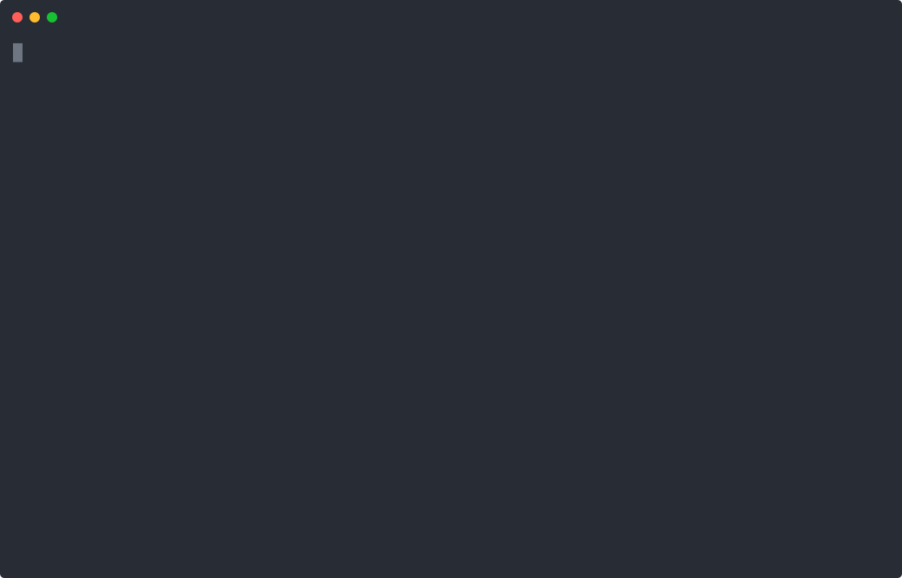

# Typed exits

Custom exits distinguish a normal listening turn, ending the chat, and escalating to a human. `result.is(escalation)` narrows the output to its reason schema.

From `packages/llmz/examples`, after the [shared setup](../README.md):

```sh
pnpm start 02_chat_exits
```

Ask to escalate a technical problem, or end the conversation.


