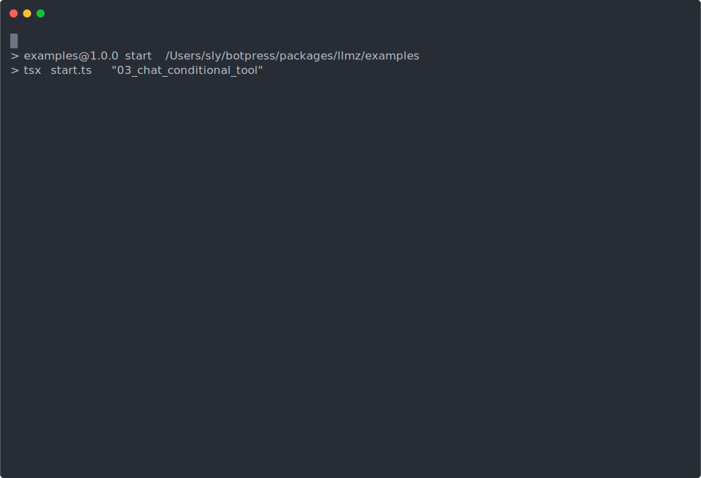

## Conditional tools

This demo shows how you can restrict tool access to only certain users and dynamically mutate the instructions and the available tools on the fly.

This approach guarantees safe and contextual execution and reduces the cognitive loads on prompts.

## 🎥 Demo

