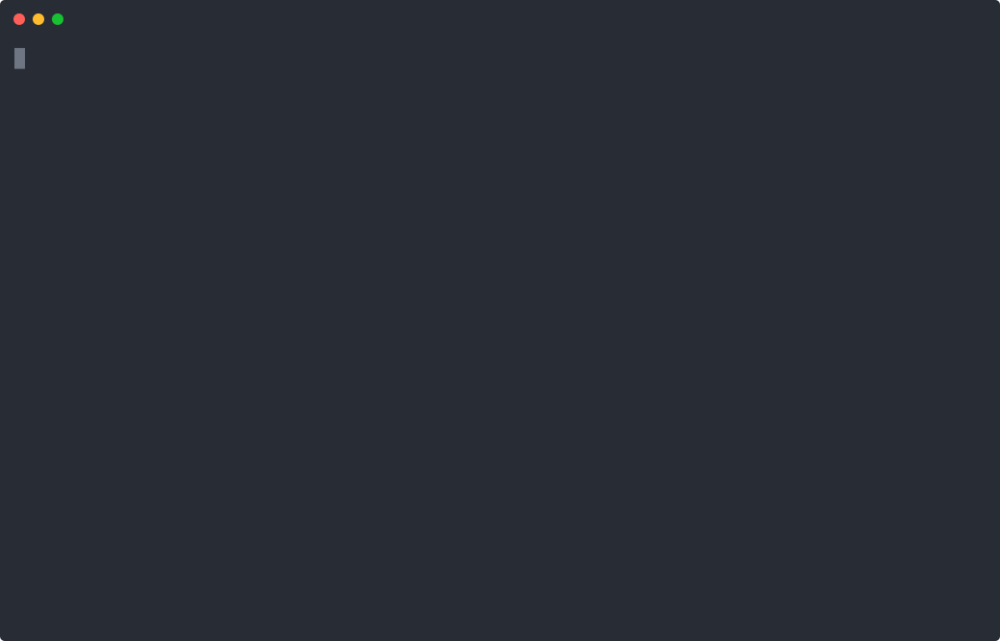

# Code and response checks

Uses a separate Cognitive request to check generated code before execution and assistant text before delivery. These are separate boundaries: ordinary text does not pass through `onBeforeExecution`. Streaming previews are disabled so unchecked text is not displayed.

From `packages/llmz/examples`, after the [shared setup](../README.md):

```sh
pnpm start 07_chat_guardrails
```

Ask for a reply in French to exercise the English-only policy. A code violation produces `ThinkSignal` feedback; a response violation blocks delivery and ends that execution with an error. These model-based checks demonstrate policy hooks and are not a guarantee of classification accuracy. Components would need their own delivery checks.


