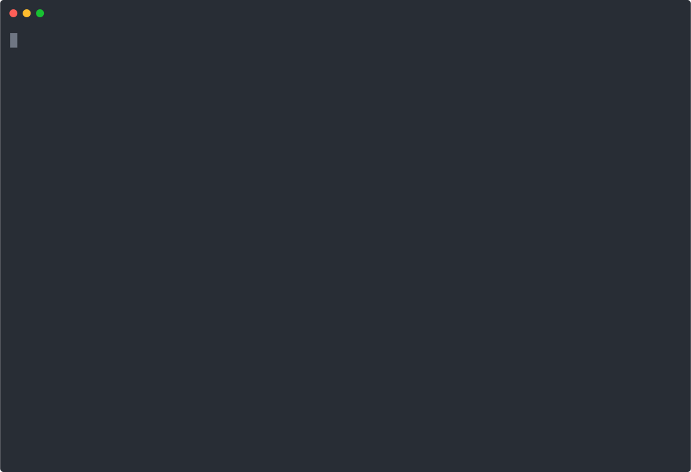

## Minimalistic Multi Agent Orchestration Framework

In this demo, we show how to implement a custom multi-agent orchestrator framework on top of LLMz in ~100 lines of code.

While simple, this framework shows how agents can handoff to other agents reliably, scope down instructions and tools, and prevent against redirection loops. This method is also resilient to bad handoffs; if an agent receives a handoff it doesn't know what to do with, it will gracefully redirect it to another agent.

## 🎥 Demo

