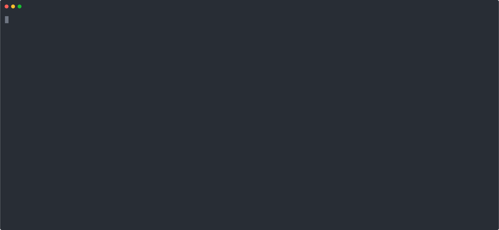

## Variables / Forms

This demo shows how LLMz can interact with variables/memory in real-time.

Also, the variables schema are asserted at assign-time, which means an error will be thrown if the validation fails and LLMz will recover gracefully. This ensures that only the right data can be written.

Variables can also be marked "readonly", in which case the sandbox has no write access to the variables and any attempt to set the value will throw a runtime error (and LLMz will recover gracefully).

## 🎥 Demo

