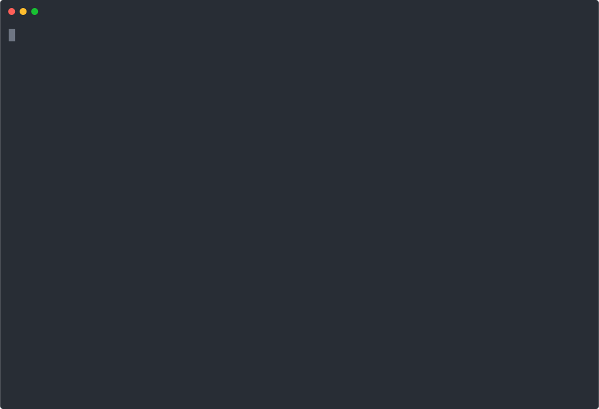

## Custom React Components for Chat

This demo shows how you can implement your own React components for the agent to reply with.
In this case, we implement a custom component for a PlaneTicket.

This demo calls a tool to purchase a ticket, then displays it to the user in the terminal using a React component.

### Code generated by LLMz

```tsx
// Display the purchased ticket details to the user
yield <Message>Your ticket has been successfully purchased!</Message>;
yield (
  <PlaneTicket
    from="New York"
    to="Los Angeles"
    date="2025-10-01"
    price={299.99}
    ticketNumber="TICKET-345633"
  />
);
```

## 🎥 Demo


