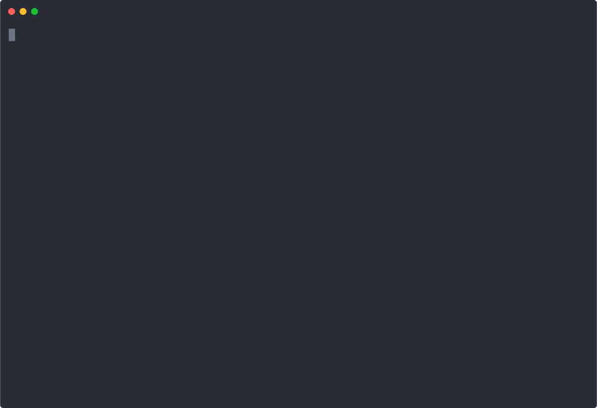

## Custom Components for Chat

This demo shows how you can implement your own components for the agent to reply with.
In this case, we implement a custom component for a PlaneTicket.

This demo calls a tool to purchase a ticket, then displays it to the user in the terminal using a custom component.

### Code generated by LLMz

```
■send=message
Your ticket has been successfully purchased!
■send=planeticket {"from": "New York", "to": "Los Angeles", "date": "2025-10-01", "price": 299.99, "ticketNumber": "TICKET-345633"}
■next=listen
```

## 🎥 Demo


