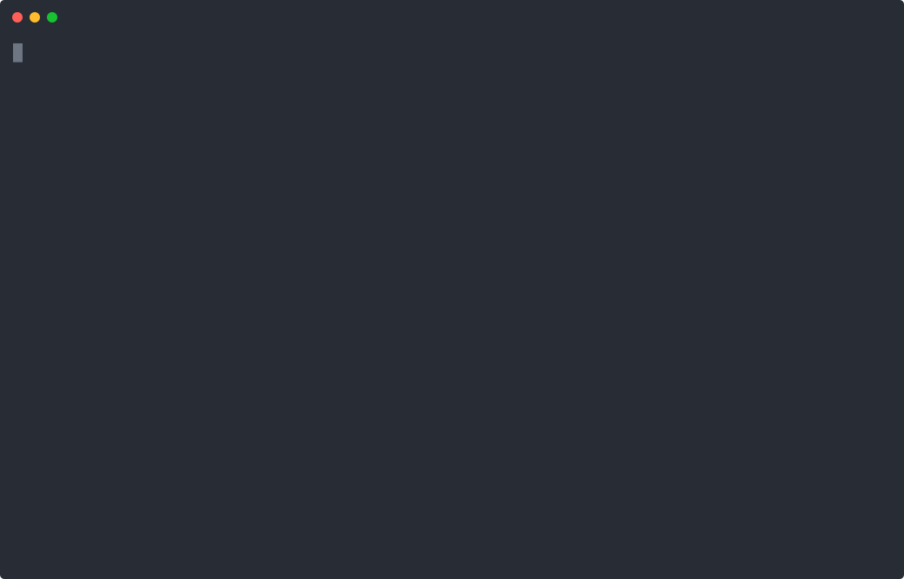

# Custom chat components

Defines a `planeTicket` component with typed props and a terminal renderer. A simulated purchase tool supplies the confirmation data; the model sends the component using `chat.planeTicket(props)` inside `run_javascript`.

From `packages/llmz/examples`, after the [shared setup](../README.md):

```sh
pnpm start 10_chat_components
```

The preloaded request uses a fictional flight on 2031-10-01. No ticket is purchased. Text is sent as a normal assistant response, separately from component delivery.

For example, the native tool’s `code` argument can contain:

```javascript
const ticket = await purchase_ticket({ from: 'New York', to: 'Los Angeles', date: '2031-10-01' })
chat.planeTicket({
  from: 'New York',
  to: 'Los Angeles',
  date: '2031-10-01',
  ticketNumber: ticket.ticketNumber,
  price: ticket.price,
})
return exit('listen')
```


