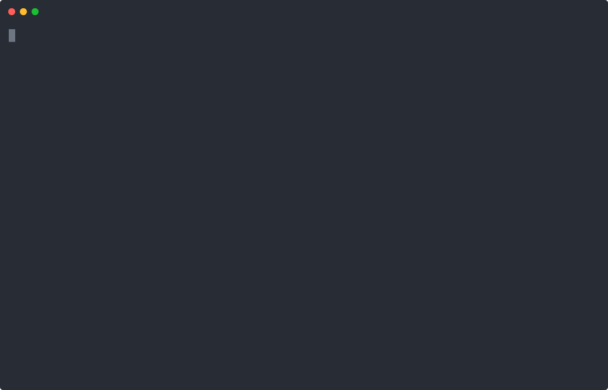

# Cloud file tools

Exposes a namespaced `fs` object backed by the Botpress Files API. The worker reads or creates today’s note under `/notes`, then returns a typed exit. These are cloud files, not access to your local filesystem.

From `packages/llmz/examples`, after the [shared setup](../README.md):

```sh
pnpm start 12_worker_fs
```

Use a development bot: this example uploads a real file and its utility exposes write, move, and delete operations. The note filename uses an ISO date and `.txt` extension.


