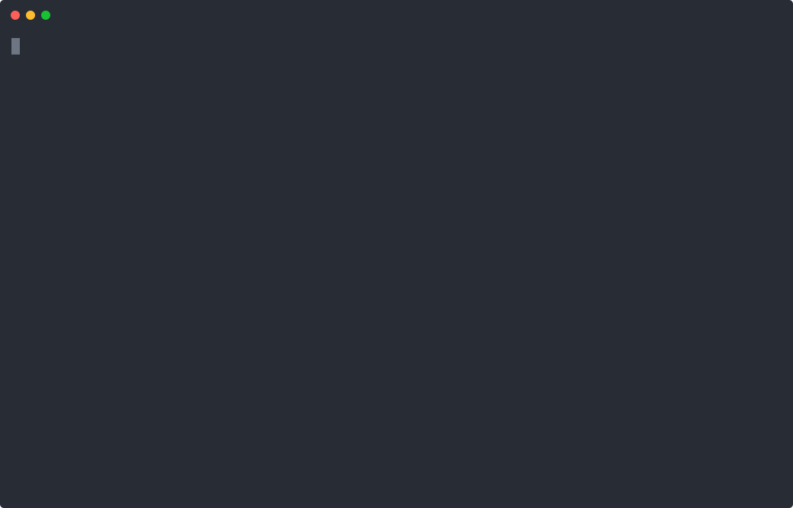

# Execution diagnostics

A tool deliberately throws an error. With one iteration allowed, the worker cannot repair the failure; the example displays the execution error and mapped stack trace.

From `packages/llmz/examples`, after the [shared setup](../README.md):

```sh
pnpm start 15_worker_stacktraces
```

A failed execution is the expected outcome. This demonstrates diagnostics without introducing a retry workflow.


