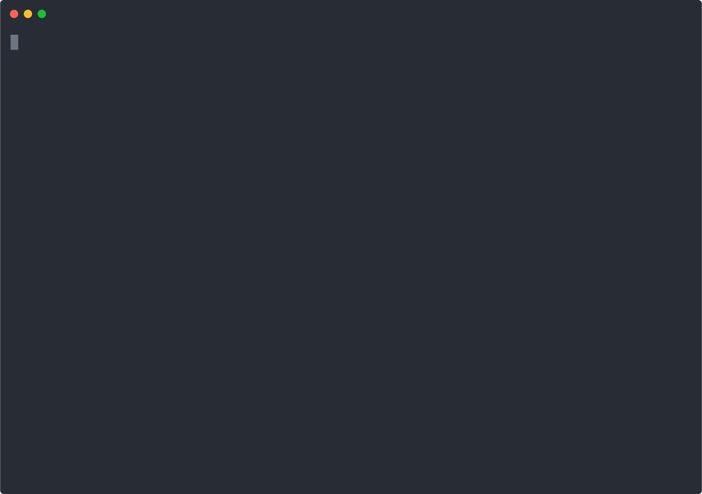

## Single-turn tool chaining

Tool C requires output from Tool A + filtered output from Tool B.
LLMz is aware of the output schemas, and can chain tool calls in a single LLM turn.
Because it generates code, it can also handle complex logic and conditions between tool calls.

In the definition of Tool C, we mention that we want numbers from Tool B that are greater than 50.

```ts
const ToolC = new Tool({
  name: 'tool_c',
  input: z.object({
    first_task: z.number().describe('Number from tool A'),
    second_task: z.number().array().describe('Numbers from tool B that are greater than 50'),
    //                                                                 ^^^^^^^^^^^^^^^^^^^^
  }),
  // ...
```

## Generated code by LLMz

```tsx
// Directly perform the steps to get the 'secret' number in one step as per instructions
const toolAResult = await tool_a()
const toolBResult = await tool_b()
const secretNumber = await tool_c({
  first_task: toolAResult.pick.deep.deep_number,
  second_task: toolBResult.filter((num) => num > 50),
})
return { action: 'exit', value: { result: secretNumber } }
```

## 🎥 Demo


