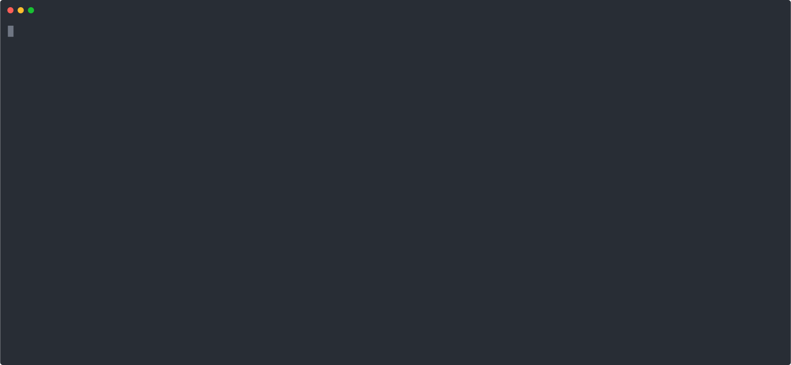

## 🔒 Secure Code Execution

The code generated by LLMz runs in a hardened **Node.js isolate**. Each iteration is sandboxed in its own isolated VM context with strict execution limits.

### 🖥️ Fully Local and Self-Contained

LLMz runs **entirely locally**. It does **not**:

- Rely on external SaaS
- Use Docker or Linux containers
- Make any outbound web calls

Instead, it uses **V8 Isolates** — the same secure sandboxing technology used by **Chrome, Edge, and other modern browsers** to run extensions, untrusted scripts, and web pages in separate memory-safe environments.

This gives LLMz the same low-level isolation primitives trusted at internet scale — but applied locally, with full control.

### 🧱 Enforced Sandbox Restrictions:

- `require`, `process`, `Buffer`, `setImmediate` are _not defined_.
- Execution time is strictly limited per iteration.
- Memory usage is capped, triggering isolate disposal on abuse.
- Global objects like `console`, `globalThis`, `this.constructor` are locked down or sanitized.
- Each code run is in a _new context_, so persistent tampering doesn't carry over.

## 🎥 Demo

### ✅ Prevented and Blocked Attacks:

| Category                 | Attack                                                        | Status                                                                         |
| ------------------------ | ------------------------------------------------------------- | ------------------------------------------------------------------------------ |
| **Filesystem**           | `rm -rf /`, `fs.writeFileSync`, `fs.readFileSync`             | ❌ `require` is blocked – file system access denied                            |
| **Process Access**       | `process.env`, `process.cwd()`                                | ❌ `process` is not defined                                                    |
| **Require Abuse**        | Native module loading, `require.cache`, hijacking `require()` | ❌ `require` is not defined                                                    |
| **Infinite Loops**       | `while (true)`, recursion, memory growth                      | ✅ Terminated by timeout or memory cap (`execution_error`, `Isolate disposed`) |
| **Global Escape**        | `this.constructor.constructor('return process')()`            | ❌ `this.constructor` is undefined                                             |
| **Async Resource Loops** | `setImmediate`, `Promise flood`                               | ❌ `setImmediate` not defined, Promises fail to clone                          |
| **Buffer Abuse**         | `Buffer.allocUnsafe(...)`                                     | ❌ `Buffer` is not defined                                                     |
| **Global Leak Attempts** | `globalThis`, `console hijacking`                             | ✅ Execution fails or isolate gets killed                                      |

### ⚠️ Disclaimer

You should **not run arbitrary user-submitted code** (e.g. copy-pasted by users, not generated by LLMz) next to your production backend — **even inside LLMz**.

While LLMz provides a robust sandbox, it is **not a complete isolation layer** suitable for multi-tenant production security.

On **Botpress Cloud**, each customer runs:

- In their **own completely isolated AWS Lambda environment**
- With stripped privileges
- On top of the **LLMz sandbox**

That’s the level of defense-in-depth required to run unknown code safely at scale.
