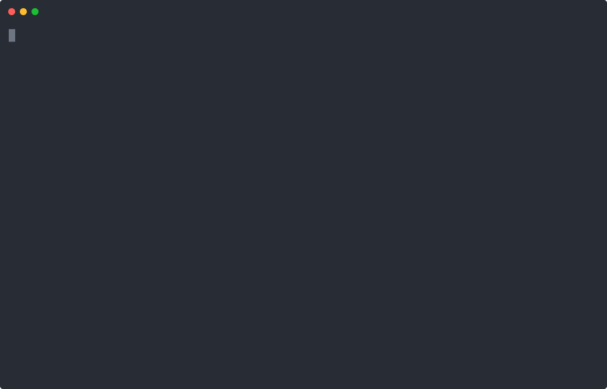

# Sandbox security checks

Runs all 15 attack cases against generated-code execution: infinite loops, recursive stack overflow, promise flooding, memory exhaustion, CPU exhaustion, Node imports and `require`, constructor escapes, global inspection, raw buffer access, stack inspection, and environment access.

From `packages/llmz/examples`, after the [shared setup](../README.md):

```sh
pnpm start 18_worker_security
```

Each case replaces the generated code in `onBeforeExecution` with the exact attack payload, limits execution to one iteration and a two-second execution timeout, and prints the traces and outcome. There is one Cognitive generation request per case. Generation time is additional to the execution timeout.

Run with the default QuickJS WebAssembly runtime. It enforces a memory limit and execution interrupts. Do not disable QuickJS for these checks: the Node driver is unsandboxed, and LLMz can also fall back to it if QuickJS fails to initialize.

Blocked operations and exhausted limits should produce errors. The global and stack inspection cases can finish without an exception; inspect their traces for information disclosure. Since the payloads do not call an exit, an error status alone does not prove isolation. These cases supplement the VM regression tests; they are not a complete security audit.


