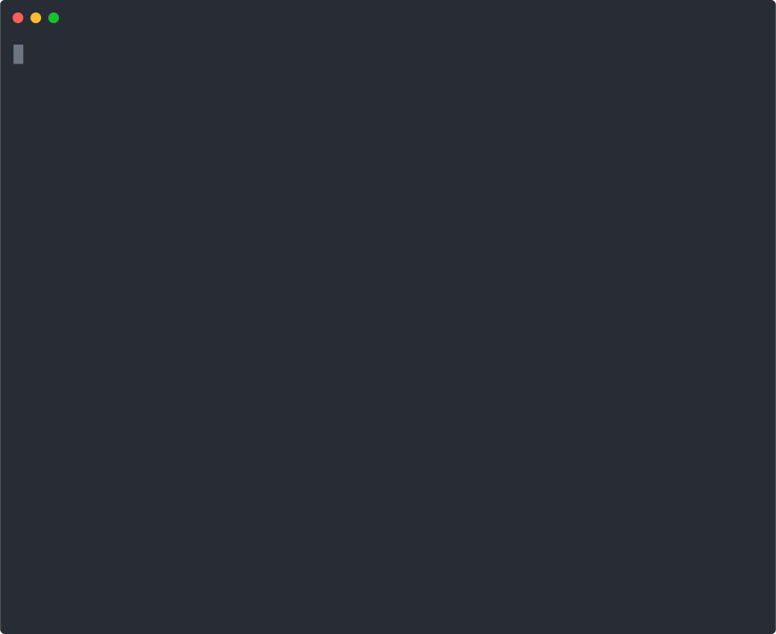

## Wrapping existing tools

This is an example of how you can clone and mutate the schema and logic of existing tools.
In this example, we fork a tool to add extra output properties and add extra logging before/after calling the original tool logic.

## 🎥 Demo

