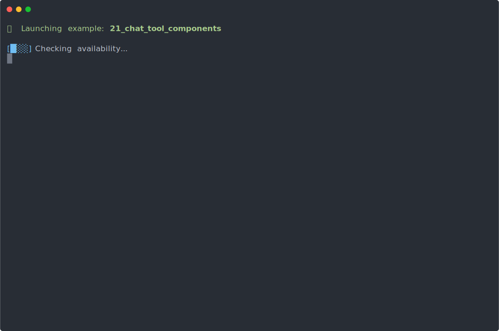

## Yielding Components from Tool Handlers

This demo shows how tool handlers can directly yield UI components back to the chat using **async generator functions** (`async function*`). Unlike example 10 where the LLM yields components after calling a tool, here the tool handler itself controls what to display and when.

The `purchase_ticket` tool handler is an async generator that yields progress updates and the final ticket — the LLM doesn't need to know about components at all.

### Handler pattern

```tsx
async *handler({ from, date, to }) {
  // Yield progress components step by step
  yield ProgressComponent.render({ message: 'Checking flight availability...', step: 1, total: 3 })
  yield ProgressComponent.render({ message: 'Calculating best price...', step: 2, total: 3 })

  // Yield the final ticket component
  yield PlaneTicketComponent.render({
    from, to, date,
    price: 299.99,
    ticketNumber: 'TICKET-345633',
  })

  // Return the tool result for the LLM
  return { price: 299.99, ticketNumber: 'TICKET-345633', confirmation: '...' }
}
```

### Contrast with example 10

|                                | Example 10                          | Example 21                      |
| ------------------------------ | ----------------------------------- | ------------------------------- |
| Who yields components          | LLM-generated JSX code              | Tool handler itself             |
| Tool handler type              | `async (input) => output`           | `async function* (input)`       |
| LLM needs to know components   | Yes — included as component aliases | No — tool handles it internally |
| Progress updates mid-execution | Not possible                        | `yield` between steps           |

## 🎥 Demo


