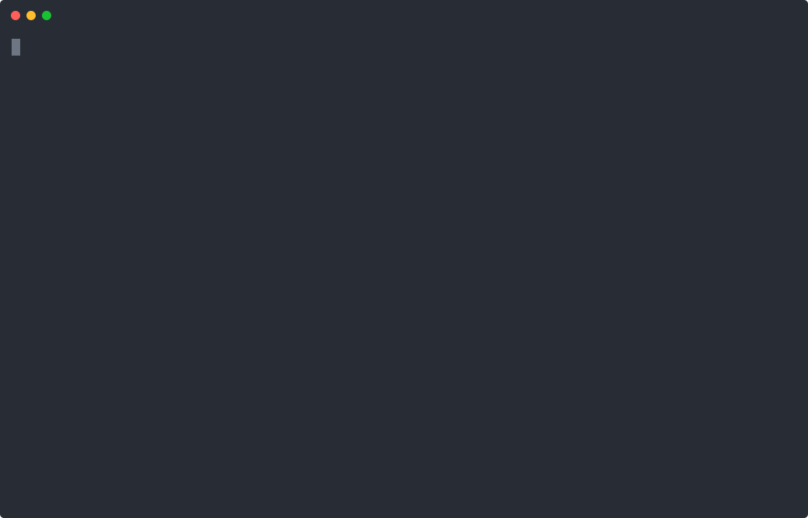

# Streaming text and rich messages

A simulated space-travel booking demonstrates `response.onDelta`, `response.handler`, component handlers, traces, and typed exits. Booking and payment are in-memory tools; no money is charged.

From `packages/llmz/examples`, after the [shared setup](../README.md):

```sh
pnpm start 22_chat_streaming
```

Deltas are provisional previews. On restart, retract the earlier preview; use the final response handler as the authoritative delivery. Traces can interleave with streamed text and code execution. Enter an empty reply to leave.

The stats footer reports the last iteration’s model, tokens, generation duration, and time to first token. `onTrace` reports tool outcomes and generated code when generation completes; it does not promise to run before the code starts.


